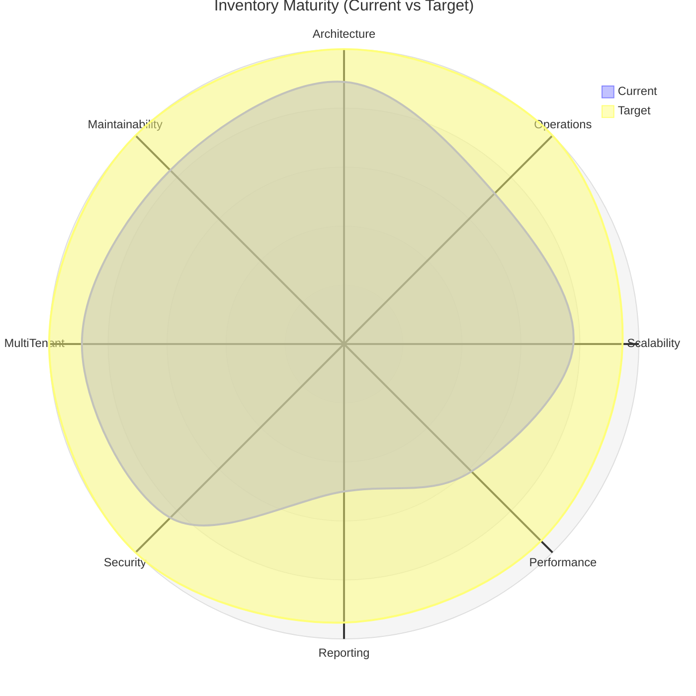
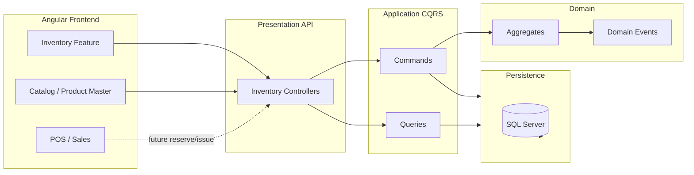

# GastroERP — Inventory Module Architecture Document

**Document Type:** Enterprise Architecture Specification  
**Product:** GastroERP  
**Module:** Inventory Management  
**Version:** 1.0  
**Status:** Living Architecture Document  
**Classification:** Internal — Architecture & Engineering  
**Last Updated:** 2026-07-11  

---

## Document Control

| Field | Value |
|-------|-------|
| Title | GastroERP Inventory Module — Complete Architecture Documentation |
| Audience | Solution Architects, Domain Engineers, Backend/Frontend Leads, QA, Product |
| Architecture Styles | DDD, Clean Architecture, CQRS, Event-Driven |
| Stack | .NET 9, MediatR, EF Core, SQL Server, Angular 18, REST (ASP.NET Core) |
| Tenancy | Multi-Tenant / Multi-Company / Multi-Branch |
| Security | JWT + RBAC (permission policies) |
| Immutable Principle | `InventoryItem → Recipe → Product` (ProductCatalogDefinition = coordinator only) |

---

## Table of Contents (All Parts)

| Part | Sections |
|------|----------|
| Part 01 | 1 Executive Summary · 2 Maturity Assessment · 3 Current State |
| Part 02 | 4 Module Map · 5 Bounded Context · 6 Domain Model |
| Part 03 | 7 Entity Relationships · 8 Product Architecture · 9 Warehouse Management |
| Part 04 | 10 Inventory Balance · 11 Inventory Transactions · 12 Inventory Pipeline |
| Part 05 | 13 Cost Engine · 14 Batch · 15 Serial · 16 Reservation Engine |
| Part 06 | 17 Physical Inventory · 18 CQRS · 19 Domain Events |
| Part 07 | 20 API Design · 21 Frontend · 22 Dashboard |
| Part 08 | 23 Reports · 24 Security · 25 Integration |
| Part 09 | 26 Performance · 27 Gap Analysis · 28 SOLID |
| Part 10 | 29 Technical Debt · 30 Roadmap · 31 Final Assessment |

---

# Part 01 — Executive Summary, Maturity Assessment, Current State

---

# 1. Executive Summary

## 1.1 Purpose

This document defines the **complete enterprise architecture** of the GastroERP Inventory Module. It is the authoritative reference for:

- How inventory stock is modeled, reserved, moved, valued, and reported.
- How Clean Architecture / DDD / CQRS boundaries are enforced.
- How the immutable product composition chain (`InventoryItem → Recipe → Product`) is preserved.
- What is implemented today (Phases A–E), what is deferred, and how the target enterprise state is reached (Phases F–J and beyond).
- How GastroERP Inventory compares in intent to mature ERP inventory cores (SAP Business One Inventory, Dynamics 365 Supply Chain, NetSuite Inventory, Odoo Inventory, NextFuture-class restaurant ERP).

The document is intended to prevent architectural drift: every feature, API, UI screen, and integration must be traceable to the principles and models herein.

## 1.2 Goals

### 1.2.1 Business Goals

| Goal ID | Goal | Success Signal |
|---------|------|----------------|
| BG-01 | Single source of truth for stock across branches and warehouses | One ledger; no module writes stock privately |
| BG-02 | Restaurant-grade inventory (raw → recipe → sellable product) | Chain never collapsed into one table |
| BG-03 | Multi-tenant SaaS isolation with company/branch scope | TenantId + CompanyId/BranchId on operational data |
| BG-04 | Operational speed for kitchen/POS (reserve, issue, waste) | Sub-second reservation & issue paths |
| BG-05 | Auditability for finance and compliance | Append-only movements + soft-delete audit |
| BG-06 | Extensible costing (WA now; FIFO/Standard ready) | Strategy-based cost engine |
| BG-07 | Bilingual UX (AR/EN, RTL-ready) | i18n keys for all inventory surfaces |

### 1.2.2 Technical Goals

| Goal ID | Goal | Mechanism |
|---------|------|-----------|
| TG-01 | Enforce Clean Architecture inward dependencies | Domain ← Application ← Infrastructure/Persistence ← Presentation |
| TG-02 | CQRS separation of write vs read | MediatR Commands / Queries |
| TG-03 | Thin controllers | Receive → MediatR → Result |
| TG-04 | Domain purity | No EF/HttpContext/IConfiguration in Domain |
| TG-05 | One Inventory Movement Pipeline | Documents confirm → Pipeline → `InventoryTransaction` + `StockMovement` |
| TG-06 | Offline-ready contracts | Idempotent commands, optimistic concurrency, sync-friendly DTOs |
| TG-07 | RBAC at endpoint and UI | `HasPermission` + Angular `permissionGuard` |

## 1.3 Scope

### 1.3.1 In Scope

- Master data: Categories, Units (and conversions), Inventory Items, Warehouses (zones/shelves/bins model), Suppliers
- Purchasing inbound: Purchase Orders, Goods Receipts (GRN), Purchase Returns
- Stock operations: Transfers, Adjustments, Waste, Stock Counts, Reservations
- Recipe linkage and Product Master coordination via Catalog
- Product Details (stock by warehouse, movements, purchase/sales/price history)
- Inventory settings (costing method flags, negative stock policy, tracking flags)
- Reporting services already present in Reporting feature (valuation, analytics hooks)
- Frontend inventory feature module (lazy routes, operations hub, master data pages)

### 1.3.2 Out of Scope (Documented but Deferred)

| Area | Status | Notes |
|------|--------|-------|
| Goods Issue (standalone GI) | Deferred | Sales/POS/Production will issue via pipeline |
| Sales Return stock put-away | Deferred | Domain event + pipeline pending |
| Production Issue / Receipt posting | Partial model | `TransactionType` exists; posting not wired |
| Full FIFO cost layers | Designed | Enum exists; engine not implemented |
| Serial number aggregate | Target | Not yet a first-class Domain aggregate |
| Full Dashboard KPIs API | Phase F | Placeholder dashboard exists |
| Inventory Reports UI | Phase G | Backend analytics partially exist |
| Offline sync runtime | Design | Platform hooks exist (`WarehouseSyncRuns`) |

### 1.3.3 Explicit Non-Goals

- Merging `InventoryItem`, `Recipe`, and `Product` into a single persistence model.
- Allowing Sales/POS/Finance to update on-hand quantity without going through the Inventory Pipeline.
- Dual ledgers per module (forbidden).

## 1.4 Business Value

| Value Stream | How Inventory Delivers |
|--------------|------------------------|
| Cost control | Waste + recipe yield + weighted average / future FIFO |
| Service continuity | Reorder levels, low-stock queries, reservations for POS |
| Multi-branch ops | Warehouse types (Main, POS, Production, Transit, Damaged, Returns…) |
| Traceability | Batches, document references on `InventoryTransaction` |
| Speed to market | Catalog coordinator enables Product Master without breaking stock model |
| Compliance | Soft delete, audit fields, RBAC, approval-oriented document statuses |

Comparable ERP value propositions:

- **SAP B1:** Document-driven inventory (GRPO, Goods Issue, Inventory Transfer) → GastroERP mirrors with PO/GRN/Transfer/Adjustment aggregates.
- **Dynamics 365:** Warehouse + reservation + costing methods → mirrored via Warehouse hierarchy, `InventoryReservation`, `InventoryCostingMethod`.
- **NetSuite:** Multi-location inventory + average cost → WarehouseId scoped movements + WeightedAverage default.
- **Odoo:** Stock moves as universal unit → GastroERP target = single `StockMovement` ledger.
- **Restaurant ERP:** Recipe explosion → first-class `Recipe` / `RecipeItem` aggregates.

## 1.5 Target Users

| Persona | Primary Needs | Module Surfaces |
|---------|---------------|-----------------|
| Inventory Manager | Master data, counts, transfers, valuation | Categories, Units, Warehouses, Operations, Reports |
| Purchasing Officer | PO → GRN → Return | Purchases, Goods Receipts, Purchase Returns |
| Warehouse Keeper | Receive, put-away, transfer, count | Operations hub, Warehouse |
| Kitchen / Production | Recipe issue, waste | Recipe, Waste, Production (future) |
| POS Cashier / Store | Reserve & consume | Reservation engine (via Sales/POS) |
| Branch Manager | KPIs, low stock, waste | Dashboard, Alerts |
| Accountant | Valuation, ledger, COGS | Cost engine, Finance integration |
| Platform Admin | Tenant settings, permissions | Inventory Settings, Identity RBAC |
| Solution Architect | Boundaries & extensibility | This document |

## 1.6 Guiding Architecture Principle (Immutable)

```text
InventoryItem          ← stockable SKU / raw / manufactured ingredient
        │
        ▼
Recipe                 ← bill of materials + yield/waste for a Product
        │
        ▼
Product                ← sellable POS/menu entity
```

**`ProductCatalogDefinition`** is a **coordinator only**. It orchestrates sections (general, inventory, recipe, POS, pricing, extensions) without replacing or merging the three entities.

**Rationale:** Restaurant ERP requires independent lifecycles—ingredients can exist without being sold; recipes version independently; products can be sold without inventory (service items) or with inventory (retail). Collapsing them destroys costing, recipe yield, and POS flexibility.

---

# 2. Inventory Maturity Assessment

Scoring rubric (enterprise ERP scale):

| Score | Meaning |
|-------|---------|
| 1–2 | Missing / conceptual only |
| 3–4 | Partial / prototype |
| 5–6 | Usable MVP with gaps |
| 7–8 | Production-capable with known limitations |
| 9–10 | Enterprise-complete, battle-tested |

## 2.1 Dimension Scores (Current — July 2026)

| Dimension | Score | Weight | Weighted | Evidence |
|-----------|-------|--------|----------|----------|
| Architecture (DDD/Clean/CQRS) | **8.0** | 15% | 1.20 | Layers respected; MediatR; Domain aggregates |
| Operations Coverage | **6.5** | 15% | 0.98 | GRN/Transfer/Adjust/Waste/Count/Return UI+API; GI/Sales Return deferred |
| Scalability Design | **7.0** | 10% | 0.70 | Multi-tenant, pagination, AsNoTracking queries |
| Performance Runtime | **5.5** | 10% | 0.55 | Indexes partial; caching limited; pipeline not posting yet |
| Reporting | **4.5** | 10% | 0.45 | Analytics services exist; Inventory Reports UI pending (Phase G) |
| Security & Compliance | **7.5** | 10% | 0.75 | RBAC permissions; audit fields; soft delete |
| Multi-Tenant / Org Scope | **8.0** | 10% | 0.80 | TenantId everywhere; Branch/Company on Warehouse |
| Maintainability | **7.5** | 10% | 0.75 | File-scoped, validators, mapping profiles |
| Costing Engine | **3.5** | 5% | 0.18 | Enum + settings; no strategy implementation / layers |
| Movement Pipeline Integrity | **3.0** | 5% | 0.15 | Model exists; confirm handlers do not post ledger yet |

**Overall Weighted Score: ~6.5 / 10** — **Solid enterprise foundation; operational MVP live; ledger posting & costing engine are the critical path to 8.5+.**

## 2.2 Architecture Maturity Detail

| Criterion | Current | Target | Gap |
|-----------|---------|--------|-----|
| Aggregate boundaries | Clear | Clear | Low |
| Domain events raised | Partial | Full set on every state change | Medium |
| Domain event handlers posting stock | Missing | Required | **High** |
| Specifications pattern | Rare | Prefer for complex queries | Medium |
| Domain services (costing, availability) | Minimal | Required | **High** |
| Anti-corruption for POS/Sales | Implicit | Explicit ACL | Medium |

## 2.3 Operations Maturity Detail

| Operation | Domain | API | UI | Ledger Post | Maturity |
|-----------|--------|-----|----|-------------|----------|
| Goods Receipt | ✅ | ✅ | ✅ | ❌ | 6/10 |
| Purchase Return | ✅ | ✅ | ✅ | ❌ | 6/10 |
| Stock Transfer | ✅ | ✅ | ✅ | ❌ | 6/10 |
| Stock Adjustment | ✅ | ✅ | ✅ | ❌ | 6/10 |
| Waste | ✅ | ✅ | ✅ | ❌ | 6/10 |
| Stock Count | ✅ | ✅ | ✅ | ❌ | 6/10 |
| Reservation | ✅ | ✅ | ❌ dedicated UI | N/A (soft) | 5/10 |
| Goods Issue | ❌ | ❌ | ❌ | ❌ | 1/10 |
| Sales Return | ❌ | ❌ | ❌ | ❌ | 1/10 |
| Production Issue/Receipt | Enum only | ❌ | ❌ | ❌ | 2/10 |
| Opening Balance | ❌ | ❌ | ❌ | ❌ | 1/10 |

## 2.4 Scalability & Performance

| Area | Assessment |
|------|------------|
| Horizontal API scale | Stateless Presentation + MediatR — ready |
| DB scale | Needs covering indexes on `(TenantId, InventoryItemId, WarehouseId)` for movements |
| Read models | Product details queries exist; dedicated balance projection table recommended |
| Caching | Opportunity: warehouse list, units, categories, settings |
| Background jobs | Needed for expiry, reservation expire, reorder alerts |

## 2.5 Reporting Maturity

| Report | Backend | Frontend | Score |
|--------|---------|----------|-------|
| Stock Valuation | Partial (`GetStockValuationReportQuery` / analytics) | ❌ | 4 |
| Movement History | Item movements API | Product Details only | 5 |
| Low Stock | `GetLowStockItemsQuery` | Dashboard KPI partial | 5 |
| ABC / Turnover / Dead Stock | Partial analytics | ❌ | 3 |
| Warehouse Balance Matrix | stock-by-warehouse | Product Details | 6 |

## 2.6 Security Maturity

| Control | Status |
|---------|--------|
| Permission constants (`Inventory.*`, `Stock.*`, `Warehouse.*`, `Purchase.*`) | ✅ |
| `HasPermission` on controllers | ✅ |
| Frontend aliases in `AuthService` | ✅ |
| Approval workflows (domain submit events) | Partial (events exist; workflow engine integration varies) |
| Soft delete / audit (`CreatedAt/By`, `Updated*`, `Deleted*`) | ✅ on auditable entities |
| Append-only ledger (no soft delete on `StockMovement`) | ✅ by design |

## 2.7 Multi-Tenant Maturity

| Aspect | Status |
|--------|--------|
| `TenantId` on aggregates | ✅ |
| Tenant resolution in API | ✅ `ITenantResolver` |
| Warehouse `BranchId` / `CompanyId` | ✅ |
| Cross-tenant query prevention | Must remain enforced in every query handler (`Where TenantId ==`) |

## 2.8 Maintainability Maturity

| Aspect | Status |
|--------|--------|
| Feature folder structure (`Features/Inventory`) | ✅ |
| FluentValidation | ✅ |
| AutoMapper profiles | ✅ |
| Angular lazy feature module | ✅ |
| Roadmap living doc | ✅ `INVENTORY_ROADMAP.md` |
| Architecture doc (this) | ✅ |

## 2.9 Maturity Radar (Mermaid)



---

# 3. Current State Analysis

## 3.1 Current Implementation Snapshot

### 3.1.1 Backend Layers

```text
GastroErp.Presentation   → Controllers/Inventory/*, ApiRoutes.Inventory
GastroErp.Application    → Features/Inventory/{Commands,Queries,DTOs,Mapping,Validators}
GastroErp.Domain         → Entities/Inventory/*, Enums/InventoryEnums.cs, Events
GastroErp.Persistence    → ApplicationDbContext DbSets + InventoryConfigurations
GastroErp.Infrastructure → External integrations (email/SMS/jobs) as needed
```

### 3.1.2 Frontend Feature

```text
Frontend/src/app/features/inventory/
  inventory.routes.ts
  pages/ (dashboard, categories, units, warehouses, product-details, operations)
  shared/ (page-shell, skeleton, empty, error, favorites)
Frontend/src/app/features/catalog/product-master.page.*
Frontend/src/app/core/{services/inventory.service.ts, repositories/rest-inventory.repository.ts}
```

### 3.1.3 Roadmap Status

| Phase | Name | Status |
|-------|------|--------|
| A | Infrastructure | ✅ Complete |
| B | Master Data | ✅ Complete |
| C | Product Master (14 tabs) | ✅ Complete |
| D | Product Details | ✅ Complete |
| E | Inventory Operations (MVP) | ✅ Complete (ledger posting deferred) |
| F–J | Dashboard, Reports, UX, Config, Extensions | ⏳ Pending |

## 3.2 Strengths

1. **Correct restaurant ERP product chain** — InventoryItem / Recipe / Product separation is enforced and documented.
2. **Clean aggregate design** for Warehouse hierarchy, PO, GRN, Transfer, Count, Adjustment, Waste, Reservation, Batch, Transaction.
3. **CQRS + FluentValidation + thin controllers** — enterprise baseline quality.
4. **Rich `TransactionType` enum** already anticipates Production, SalesConsumption, StockCountCorrection.
5. **Operations hub UI** delivers day-1 operational capability without waiting for perfect ledger posting.
6. **Bilingual i18n** and permission aliases reduce adoption friction in MENA deployments.
7. **Settings aggregate** (`InventorySetting`) centralizes costing method and tracking flags.

## 3.3 Weaknesses

1. **Confirm/Complete handlers flip document status but do not post `InventoryTransaction` / `StockMovement`.** Stock balances derived from movements will be incomplete until the Pipeline is wired.
2. **Cost engine is declarative only** (enum + settings); no FIFO layers / WA recalculation service on post.
3. **Goods Issue / Sales Return / Opening Balance** not first-class operations yet.
4. **Serial numbers** not modeled as a Domain aggregate.
5. **Dashboard and Reports UI** still incomplete relative to Reporting backend capabilities.
6. **Some Domain events declared but never raised** (`StockMovementRecordedEvent`, `ReorderLevelReachedEvent`, `BatchExpiredEvent`).
7. **Warehouse zones/bins** exist in Domain; limited CRUD exposure in Phase B UI.

## 3.4 Technical Debt (Summary — Full List in §29)

| ID | Debt | Severity | Impact |
|----|------|----------|--------|
| TD-01 | No Inventory Movement Pipeline service | Critical | Incorrect on-hand until fixed |
| TD-02 | Costing strategy not implemented | High | Valuation unreliable |
| TD-03 | Adjustment/Waste reason may be `Guid.Empty` | Medium | Reporting quality |
| TD-04 | Stock count warehouse name not projected in ops UI | Low | UX |
| TD-05 | Taxes/Logistics/Accounting extras in catalog JSON | Medium | Temporary until Domain fields |
| TD-06 | Reservation UI missing in Operations hub | Medium | Ops discoverability |

## 3.5 Risks

| Risk | Likelihood | Impact | Mitigation |
|------|------------|--------|------------|
| Users trust UI documents as stock truth while ledger empty | High | High | Prioritize Pipeline (Phase E completion / hotfix) |
| Negative stock with `AllowNegativeInventory=false` not enforced at post | Medium | High | Enforce in Pipeline |
| Multi-warehouse transfers complete without out/in pair movements | High | High | Pipeline posts `StockTransferOut` + `StockTransferIn` |
| Cost method change mid-period without revaluation job | Medium | Medium | Document policy; add revaluation command |
| Catalog coordinator abused as inventory store | Low | High | Architecture reviews; this document |

## 3.6 Current-State Context Diagram



## 3.7 Design Decision Log (Current)

| Decision | Choice | Alternatives Rejected | Why |
|----------|--------|----------------------|-----|
| Product modeling | Composition chain | Single Product table with flags | Recipe/cost/POS independence |
| Stock truth | Append-only movements | Mutable OnHand column only | Audit + costing |
| Write model | Document aggregates then post | Direct stock UPDATE | ERP document trail |
| UI for ops | Single hub with tabs | One route per op only | Faster Phase E delivery |
| Cost default | Weighted Average | FIFO first | Simpler for F&B average purchases |

## 3.8 Part 01 Conclusion

GastroERP Inventory is an **architecturally sound, restaurant-aware ERP inventory core** with **Phases A–E operational surfaces live**. The decisive enterprise gap is **ledger posting integrity** (single Inventory Movement Pipeline) and the **cost engine**. Closing those gaps lifts maturity from ~6.5 toward **8.5–9.0**, aligning with Dynamics/NetSuite-class inventory discipline while retaining GastroERP’s recipe-centric differentiation.

---

> **Continue with Part 02**
