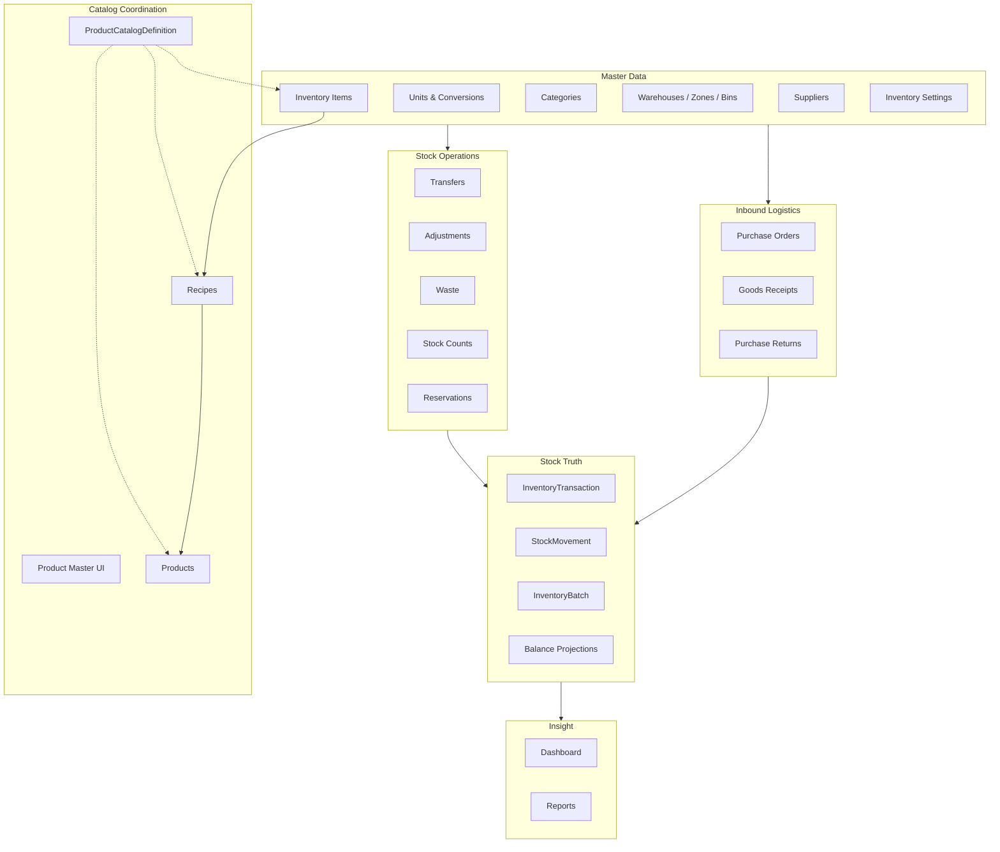
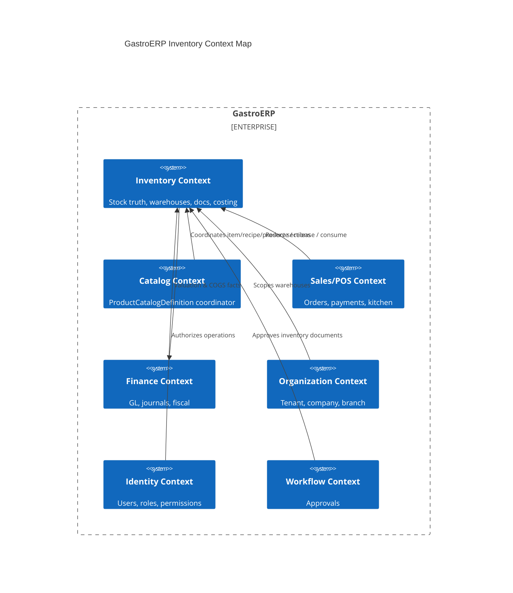
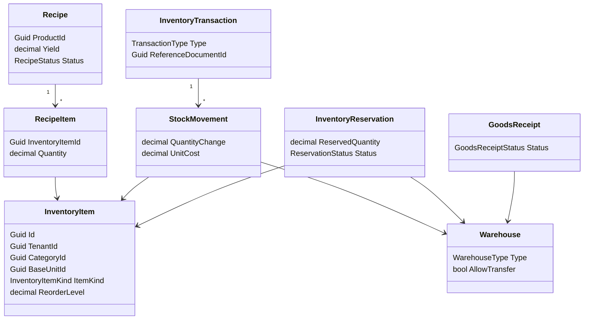

# GastroERP — Inventory Module Architecture Document

# Part 02 — Module Map, Bounded Context, Domain Model

**Continues from Part 01 · Sections 4–6**

---

# 4. Module Map

The Inventory Module is a **bounded set of capabilities** exposed through APIs and Angular routes. Each submodule owns a clear responsibility and may not update on-hand stock except via the Inventory Movement Pipeline (see §12).

## 4.1 Module Landscape



## 4.2 Submodule Catalog

### 4.2.1 Products / Inventory Items

| Attribute | Detail |
|-----------|--------|
| Purpose | Define stockable materials and manufactured ingredients |
| Aggregate | `InventoryItem` |
| Kind | `Raw` \| `Manufactured` (`InventoryItemKind`) |
| Key fields | SKU, Barcode, Category, BaseUnit, ReorderLevel/Quantity, Active |
| Routes | `/inventory/items`, `/inventory/items/:id`, `/inventory/items/:id/details` |
| Permissions | `Inventory.View`, `Inventory.Manage` |
| Notes | Not the sellable Product; may feed Recipes |

### 4.2.2 Categories

| Attribute | Detail |
|-----------|--------|
| Purpose | Unlimited-depth taxonomy for items |
| Aggregate | `InventoryCategory` |
| Hierarchy | `ParentCategoryId` self-reference |
| UX | `/inventory/categories` |
| Attributes | Code, NameAr/En, Icon, Color, SortOrder, Image |

### 4.2.3 Units

| Attribute | Detail |
|-----------|--------|
| Purpose | Measurement units for purchase, stock, recipe |
| Aggregate | `InventoryUnit` + `UnitConversion` |
| Fields | Code, Symbol, DecimalPlaces, optional BaseUnitId |
| UX | `/inventory/units` |

### 4.2.4 Warehouses

| Attribute | Detail |
|-----------|--------|
| Purpose | Physical/logical stock locations |
| Aggregate | `Warehouse` → Zone → Shelf → Bin |
| Types | Main, POS, Production, RawMaterial, FinishedGoods, Returns, Damaged, Transit |
| Flags | AllowPurchase, AllowSales, AllowTransfer, AllowInventoryCount, AllowManufacturing |
| Scope | `TenantId`, optional `BranchId`, `CompanyId` |
| UX | `/inventory/warehouses` |

### 4.2.5 Transactions (Operations Hub)

| Attribute | Detail |
|-----------|--------|
| Purpose | Day-to-day stock documents + ledger view |
| UX | `/inventory/transactions` |
| Tabs | Ledger, Transfer, Adjust, Waste, GRN, Count, Purchase Return |
| Permission | `Stock.View` (+ Transfer/Adjust/Waste for writes) |

### 4.2.6 Inventory Count

| Attribute | Detail |
|-----------|--------|
| Aggregate | `StockCount` / `StockCountLine` |
| Statuses | Draft → InProgress → Review → Completed / Cancelled |
| Commands | Create, AddLine, Freeze, Approve |
| Variance | `Actual − Expected` on line |

### 4.2.7 Transfers

| Attribute | Detail |
|-----------|--------|
| Aggregate | `StockTransfer` / `StockTransferLine` |
| Statuses | Draft → InTransit → Completed / Cancelled |
| Pipeline effect (target) | `-Qty` source (`StockTransferOut`) + `+Qty` destination (`StockTransferIn`) |

### 4.2.8 Adjustments

| Attribute | Detail |
|-----------|--------|
| Aggregate | `StockAdjustment` / `StockAdjustmentLine` |
| Quantity | Signed (+ increase / − decrease) |
| Reason | `AdjustmentReason` lookup |
| Pipeline | `StockAdjustmentPositive` / `StockAdjustmentNegative` |

### 4.2.9 Reservations

| Attribute | Detail |
|-----------|--------|
| Aggregate | `InventoryReservation` |
| Effect | Soft hold; Available = OnHand − Active Reserved |
| Statuses | Active, Fulfilled, Expired, Cancelled |
| Sources | POS, Sales, Production, Delivery, Online (via `SourceDocument`) |
| API | `/inventory/reservations` |

### 4.2.10 Waste

| Attribute | Detail |
|-----------|--------|
| Aggregate | `WasteRecord` / `WasteItem` |
| Reason | `WasteReason` |
| Pipeline | `TransactionType.Waste` (negative movement) |

### 4.2.11 Purchasing (Inventory-adjacent)

| Attribute | Detail |
|-----------|--------|
| PO | `PurchaseOrder` lifecycle with approval |
| GRN | `GoodsReceipt` confirms inbound |
| Return | `PurchaseReturn` outbound to supplier |
| Controllers | Purchase, GoodsReceipt, PurchaseReturn, Supplier |

### 4.2.12 Recipes & Product Coordination

| Attribute | Detail |
|-----------|--------|
| Recipe | Links `ProductId` to `InventoryItem` ingredients |
| Product Master | `/catalog/master` — 14 tabs via `ProductCatalogDefinition` |
| Rule | Coordinator never owns stock quantities |

### 4.2.13 Dashboard

| Attribute | Detail |
|-----------|--------|
| Current | Entry KPIs + shortcuts + favorites (Phase A/D partial) |
| Target Phase F | Dedicated dashboard API, charts, alerts, warehouse summary |

### 4.2.14 Reports

| Attribute | Detail |
|-----------|--------|
| Current | Reporting feature analytics services |
| Target Phase G | Full Inventory Reports UI (ledger, valuation, ABC, turnover, etc.) |

## 4.3 Module Dependency Matrix

| From \ To | Items | WH | PO/GRN | Ops Docs | Ledger | Recipe | Catalog |
|-----------|-------|----|--------|----------|--------|--------|---------|
| Items | — | R | R | R | R | R | R/W coord |
| Warehouses | — | — | R | R | R | — | — |
| PO/GRN | R | R | — | — | W* | — | — |
| Ops Docs | R | R | — | — | W* | — | — |
| Ledger | R | R | R | R | — | — | — |
| Recipe | R | — | — | W* issue | W* | — | R Product |
| Catalog | coord | — | — | — | — | coord | — |

\*W = write via Pipeline only (target state).

## 4.4 Route Map (Frontend)

| Path | Module | Permission |
|------|--------|------------|
| `/inventory/dashboard` | Dashboard | Inventory.View |
| `/inventory/items` | Items list | Inventory.View |
| `/inventory/items/new` | Item create | Inventory.Manage |
| `/inventory/items/:id` | Item edit | Inventory.Manage |
| `/inventory/items/:id/details` | Product Details | Inventory.View |
| `/inventory/categories` | Categories | Inventory.View |
| `/inventory/units` | Units | Inventory.View |
| `/inventory/warehouses` | Warehouses | Warehouse.View |
| `/inventory/transactions` | Operations | Stock.View |
| `/inventory/reports` | Reports placeholder | Inventory.View |
| `/inventory/settings` | Settings placeholder | Inventory.Manage |
| `/catalog/master` | Product Master | Catalog.* / Inventory |

---

# 5. Bounded Context

## 5.1 Inventory Context Definition

**Name:** Inventory Management Context  
**Mission:** Own the truth of **what stock exists, where it is, what it costs, and how it moved**, for a tenant’s companies and branches.

**Ubiquitous Language (selected):**

| Term | Meaning |
|------|---------|
| Inventory Item | Stockable SKU (raw or manufactured ingredient) |
| Warehouse | Stock-keeping location with operational permissions |
| On Hand | Sum of posted `QuantityChange` |
| Reserved | Soft hold not yet consumed |
| Available | On Hand − Active Reserved |
| Goods Receipt (GRN) | Inbound confirmation from purchasing |
| Stock Movement | Atomic signed quantity change with unit cost |
| Inventory Transaction | Header grouping movements for one business document |
| Recipe | BOM linking Product to Inventory Items |
| Product | Sellable offering (outside pure inventory ownership of qty) |
| Catalog Definition | Coordinator document across sections |

## 5.2 Context Boundaries

### Inside Inventory Context

- Categories, Units, Items, Warehouses, Batches
- Suppliers (purchasing master within inventory feature folder)
- PO / GRN / Purchase Return (inventory-facing purchasing)
- Transfers, Adjustments, Waste, Counts, Reservations
- Inventory Settings, Ledger (`InventoryTransaction` / `StockMovement`)
- Recipes (inventory consumption side)

### Outside (Related Contexts)

| Context | Relationship |
|---------|--------------|
| Catalog | Downstream coordinator; references InventoryItem/Recipe/Product |
| Sales / POS | Requests reservation & consumption; must not write On Hand |
| Production | Issues ingredients / receives FG via Pipeline |
| Finance / Accounting | Consumes valuation & COGS events; posts journals |
| Identity | Supplies users, roles, permissions |
| Organization | Companies, Branches, Tenant resolution |
| Workflow | Approvals for PO/Count/Adjustment/Transfer submissions |
| Notifications / AI | Reorder alerts, forecasts, daily snapshots |

## 5.3 Context Map



## 5.4 Relationship Patterns

| Upstream | Downstream | Pattern | Notes |
|----------|------------|---------|-------|
| Organization | Inventory | Shared Kernel (IDs) | Tenant/Branch/Company Guids |
| Inventory | Catalog | Conformist / ACL | Catalog must not invent stock fields as truth |
| Sales → Inventory | Customer/Supplier | Open Host + Published Language | Reservation & issue commands |
| Inventory → Finance | Published Language | Domain events / integration events |
| Workflow ↔ Inventory | Partnership | Submit* domain events |

## 5.5 Anti-Corruption Rules

1. POS must call `ReserveStock` / issue commands — never `UPDATE StockBalances`.
2. Catalog JSON extras (`__pm` taxes/logistics) are **not** inventory balances.
3. Finance may read valuation reports; it does not adjust On Hand except via documented Adjustment + Pipeline.
4. Recipe activation does not create stock; Production Issue does.

## 5.6 Team Ownership (Suggested)

| Area | Owner |
|------|-------|
| Domain aggregates & Pipeline | Inventory Domain Guild |
| Product Master UI | Catalog + Inventory FE |
| Purchasing docs | Inventory + Procurement |
| Costing & Finance events | Inventory + Finance |
| Reservations for POS | Inventory + Sales |

---

# 6. Domain Model

## 6.1 Layering Reminder

```text
Domain          Entities, VOs, Aggregates, Domain Events, Enums, Domain Services, Specs
Application     Commands, Queries, Handlers, Validators, DTOs, Interfaces, Mapping
Persistence     DbContext, Configurations, Migrations, Interceptors
Infrastructure  Email, Jobs, Cache, External APIs
Presentation    Controllers, Auth attributes, API versioning
```

## 6.2 Aggregates (Inventory)

| Aggregate Root | Children | Invariants (selected) |
|----------------|----------|------------------------|
| `InventoryCategory` | SubCategories | Tenant required; hierarchy acyclic |
| `InventoryUnit` | — | DecimalPlaces ≥ 0 |
| `UnitConversion` | — | Factor > 0; From ≠ To |
| `InventoryItem` | — | BaseUnit required; Kind Raw/Manufactured |
| `Warehouse` | Zones → Shelves → Bins | Type valid; op flags |
| `Supplier` | Contacts | Currency required |
| `PurchaseOrder` | Lines | Status transitions; totals |
| `GoodsReceipt` | Lines | Draft-only line edits; Complete → Completed |
| `PurchaseReturn` | Lines | Complete/approve path |
| `StockTransfer` | Lines | Source ≠ Destination; lines required to complete |
| `StockCount` | Lines | Status machine; variance on lines |
| `StockAdjustment` | Lines | Qty ≠ 0; Completed flag |
| `WasteRecord` | Items | Qty > 0; Completed flag |
| `AdjustmentReason` | — | Lookup |
| `WasteReason` | — | Lookup |
| `Recipe` | Items | ProductId; Yield; Status Draft/Active/Obsolete |
| `InventoryTransaction` | StockMovements | Movements qty ≠ 0 |
| `InventoryBatch` | — | Status Active/Quarantine/Expired/Depleted/Recalled |
| `InventoryReservation` | — | ReservedQuantity > 0 while Active |
| `InventorySetting` | — | One logical settings set per Tenant(/Branch) |

## 6.3 Entity Catalog (Detailed)

### InventoryItem

- **Identity:** Guid  
- **TenantId**  
- **CategoryId**, **BaseUnitId**, optional purchase/recipe units  
- **Names/Descriptions** AR/EN  
- **Sku**, **Barcode**, **ImageUrl**  
- **ItemKind**, **ReorderLevel**, **ReorderQuantity**, **IsActive**  
- **Behavior:** Create raises `InventoryItemCreatedEvent`; Activate/Deactivate  

### Warehouse

- Org scope: BranchId?, CompanyId?  
- Contact: Address, Phone, Email  
- **WarehouseType**, Manager/Responsible  
- **Allow\*** operational gates  
- Hierarchy: Zone / Shelf / Bin (location precision for put-away)

### GoodsReceipt

- Links optional `PurchaseOrderId`, required `SupplierId`, `WarehouseId`  
- `ReceiptNumber`, dates, status Draft/Completed/Cancelled  
- Lines carry UnitCost, optional Batch/Production/Expiry  
- `Complete()` raises `GoodsReceivedEvent` when PO-linked  

### InventoryTransaction + StockMovement

- Header: TransactionType, ReferenceDocumentId/Number, TransactionDate  
- Movement: Item, Warehouse, optional Bin & Batch, QuantityChange, UnitCost, TotalCost  
- StockMovement is **append-only** (no soft delete)

### InventoryReservation

- Soft allocation against Available  
- `SourceDocument` string/reference for POS/Sales/Production  
- ExpirationDate optional  

### Recipe

- Belongs to ProductId (sellable)  
- Ingredients reference InventoryItemId + UnitId + Quantity + Waste%  
- Version + Status  

## 6.4 Value Objects (Current & Target)

| VO | Status | Purpose |
|----|--------|---------|
| Money / Currency on PO | Partial (decimal + currency string) | Formalize as VO |
| Quantity (amount + unit) | Implicit | Target VO to prevent unit-less math |
| WarehouseLocation (Zone/Shelf/Bin ids) | Implicit | Target for put-away |
| DocumentNumber | string | Could enforce format policies |
| Cost (UnitCost + Method snapshot) | Target | Pipeline stamps method used |

## 6.5 Repositories

GastroERP Application uses **`IApplicationDbContext`** rather than classic per-aggregate repository interfaces for most inventory aggregates (pragmatic EF Unit of Work). This is acceptable **if**:

- All writes go through Application handlers  
- Domain remains persistence-ignorant  
- Queries use `AsNoTracking`  

**Target enhancement:** Introduce `IInventoryMovementPipeline` / `IStockBalanceReadModel` interfaces in Application for DIP around the critical stock path, without forcing repositories for every aggregate.

## 6.6 Factories

| Factory Need | Current | Target |
|--------------|---------|--------|
| Document numbers (TR-, GRN-, ADJ-) | UI-generated / client | Domain/Application number series service |
| InventoryTransaction from document | Missing | Pipeline factory methods per TransactionType |
| Batch on GRN line | Fields present | Factory ensures Batch aggregate created when tracking required |

## 6.7 Specifications (Target Usage)

| Spec | Use |
|------|-----|
| `LowStockSpecification` | ReorderLevel vs Available |
| `ExpiringBatchSpecification` | Expiration within N days |
| `ActiveReservationSpecification` | Status Active & not expired |
| `WarehouseAllowsOperationSpec` | AllowTransfer/Purchase/etc. |

## 6.8 Domain Services (Required Target Set)

| Service | Responsibility |
|---------|----------------|
| `IInventoryMovementPipeline` | Sole writer of transactions/movements |
| `IInventoryCostingService` | Resolve UnitCost by FIFO/WA/Standard |
| `IAvailabilityService` | OnHand, Reserved, Available calculations |
| `IUnitConversionService` | Convert quantities across units |
| `IReorderPolicyService` | Emit reorder events |

## 6.9 Domain Model Diagram



## 6.10 Invariant Enforcement Strategy

| Layer | Responsibility |
|-------|----------------|
| Domain entity methods | Hard business rules (status, qty ≠ 0) |
| FluentValidation | Input shape, required Guids, ranges |
| Pipeline | Cross-aggregate consistency (availability, costing, dual transfer legs) |
| Permissions | Who may invoke commands |

## 6.11 Part 02 Conclusion

The module map shows a **complete ERP inventory surface area**. The bounded context is correctly separated from Catalog/Sales/Finance. The Domain model is **enterprise-shaped**; the remaining work is finishing Domain Services (Pipeline + Costing + Availability) so aggregates’ confirmations become durable stock truth.

---

> **Continue with Part 03**
