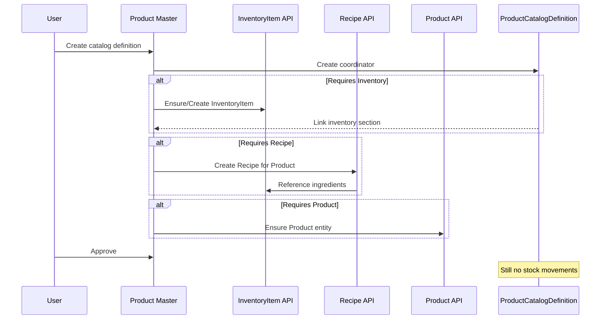
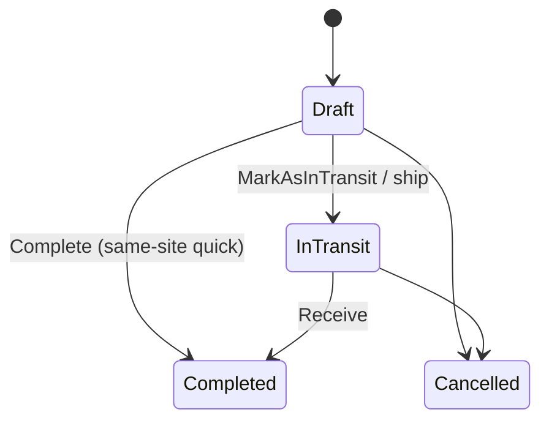

# GastroERP — Inventory Module Architecture Document

# Part 03 — Entity Relationships, Product Architecture, Warehouse Management

**Continues from Part 02 · Sections 7–9**

---

# 7. Entity Relationships

## 7.1 Conceptual ER Diagram

```mermaid
erDiagram
  InventoryCategory ||--o{ InventoryCategory : parent_of
  InventoryCategory ||--o{ InventoryItem : categorizes
  InventoryUnit ||--o{ InventoryItem : base_unit
  InventoryUnit ||--o{ UnitConversion : from_to

  Warehouse ||--o{ WarehouseZone : contains
  WarehouseZone ||--o{ WarehouseShelf : contains
  WarehouseShelf ||--o{ WarehouseBin : contains

  Supplier ||--o{ PurchaseOrder : supplies
  Warehouse ||--o{ PurchaseOrder : destination
  PurchaseOrder ||--o{ PurchaseOrderLine : lines
  InventoryItem ||--o{ PurchaseOrderLine : item

  Supplier ||--o{ GoodsReceipt : from
  PurchaseOrder ||--o| GoodsReceipt : fulfills
  Warehouse ||--o{ GoodsReceipt : into
  GoodsReceipt ||--o{ GoodsReceiptLine : lines

  Supplier ||--o{ PurchaseReturn : to
  Warehouse ||--o{ PurchaseReturn : from
  GoodsReceipt ||--o| PurchaseReturn : optional_link
  PurchaseReturn ||--o{ PurchaseReturnLine : lines

  Warehouse ||--o{ StockTransfer : source
  Warehouse ||--o{ StockTransfer : destination
  StockTransfer ||--o{ StockTransferLine : lines

  Warehouse ||--o{ StockCount : counted_at
  StockCount ||--o{ StockCountLine : lines
  StockCount ||--o| StockAdjustment : may_create

  Warehouse ||--o{ StockAdjustment : at
  StockAdjustment ||--o{ StockAdjustmentLine : lines
  AdjustmentReason ||--o{ StockAdjustmentLine : reasons

  Warehouse ||--o{ WasteRecord : at
  WasteRecord ||--o{ WasteItem : items
  WasteReason ||--o{ WasteItem : reasons

  InventoryItem ||--o{ RecipeItem : ingredient
  Recipe ||--o{ RecipeItem : contains

  InventoryTransaction ||--o{ StockMovement : movements
  InventoryItem ||--o{ StockMovement : moved
  Warehouse ||--o{ StockMovement : location
  InventoryBatch ||--o| StockMovement : tracked_by
  InventoryItem ||--o{ InventoryBatch : lots

  Warehouse ||--o{ InventoryReservation : holds
  InventoryItem ||--o{ InventoryReservation : reserved

  InventorySetting }o--|| Warehouse : default_optional
```

## 7.2 Relationship Explanations

### 7.2.1 Category Hierarchy

`InventoryCategory` self-references via `ParentCategoryId`. This enables unlimited nesting (ingredients → dairy → milk). Items reference a single category for reporting rollups; UI may show breadcrumb paths by walking parents.

### 7.2.2 Units & Conversions

Items declare a **base unit** for stock truth. Purchase and recipe units may differ; `UnitConversion` stores factors. Pipeline and recipe explosion **must** convert to base unit before posting movements (target rule).

### 7.2.3 Warehouse Location Tree

`Warehouse → Zone → Shelf → Bin` provides WMS-lite put-away precision. `StockMovement.WarehouseBinId` is optional so tenants can run warehouse-level stock first and adopt bins later.

### 7.2.4 Purchasing Chain

```text
Supplier → PurchaseOrder → GoodsReceipt → (optional) PurchaseReturn
```

PO lines track `ReceivedQuantity` for partial receipts. GRN may reference PO; returns may reference GRN for traceability.

### 7.2.5 Operational Documents → Ledger

Operational aggregates are **documents**. They do not store running On Hand. On confirmation, the Pipeline creates:

```text
Document (GRN/Transfer/…) 
   → InventoryTransaction (header, TransactionType, ReferenceDocumentId)
      → StockMovement(+) / StockMovement(−)
```

### 7.2.6 Recipe Bridge

`Recipe.ProductId` points to the sellable Product. `RecipeItem.InventoryItemId` points to stock. This is the **only approved bridge** from menu/product world into stock consumption planning.

### 7.2.7 Reservation Independence

Reservations reference Item + Warehouse but **do not** create movements until consumption/fulfillment. This preserves Available without premature COGS.

### 7.2.8 Batch Optional Link

`InventoryBatch` is aggregate for lot genealogy. Movements optionally reference `InventoryBatchId`. Items with `RequireBatchTracking` (settings) must supply batch on inbound.

## 7.3 Cardinality Summary Table

| Parent | Child | Cardinality | Delete behavior (EF intent) |
|--------|-------|-------------|-----------------------------|
| Category | Item | 1:N | Restrict if items exist |
| Warehouse | Zone | 1:N | Cascade within aggregate |
| PO | PO Line | 1:N | Cascade |
| GRN | GRN Line | 1:N | Cascade |
| Transaction | Movement | 1:N | Restrict (keep history) |
| Recipe | RecipeItem | 1:N | Cascade |
| Item | Batch | 1:N | Restrict if movements exist |

## 7.4 Multi-Tenancy Relationship Rule

Every inventory aggregate carries `TenantId`. Relationships are **never** traversed across tenants. Query handlers must filter `TenantId` before joins.

---

# 8. Product Architecture

## 8.1 The Immutable Chain

```text
InventoryItem
      │  (ingredients / stockable SKUs)
      ▼
Recipe
      │  (BOM + yield + waste % + version)
      ▼
Product
      │  (sellable POS / menu entity)
      ▼
ProductCatalogDefinition  ← coordinator only (NOT a stock entity)
```

## 8.2 InventoryItem — Responsibilities

| Responsibility | Detail |
|----------------|--------|
| Identity of stock | What can be received, transferred, counted, wasted |
| Unit of measure base | BaseUnitId |
| Replenishment hints | ReorderLevel, ReorderQuantity |
| Classification | Category, ItemKind Raw/Manufactured |
| Commercial codes | SKU, Barcode |
| Lifecycle | Active / Inactive |

**Does not:** define selling price, POS modifiers, tax groups as system of record (Catalog/Product do).

## 8.3 Recipe — Responsibilities

| Responsibility | Detail |
|----------------|--------|
| Link Product → Items | RecipeItem lines |
| Yield | Portions / output quantity |
| Process waste | WastePercentage at header and/or line |
| Versioning | Version + Status (Draft/Active/Obsolete) |
| Instructions / prep time | Operational kitchen data |

**Does not:** hold warehouse balances; posting production issues is a Pipeline concern.

## 8.4 Product — Responsibilities

| Responsibility | Detail |
|----------------|--------|
| Sellable offering | Menu/POS identity |
| Customer-facing names, media | Catalog/Product context |
| Pricing hooks | Via pricing sections |
| Optional inventory link | Through recipe and/or direct inventory flags on catalog type |

**Does not:** store On Hand.

## 8.5 ProductCatalogDefinition — Coordinator

| Responsibility | Detail |
|----------------|--------|
| Orchestrate sections | General, Inventory, Recipe, POS, Pricing, Extensions, Taxes, Logistics, Accounting |
| Type-aware UI | RequiresInventory / RequiresRecipe / RequiresProduct / RequiresPricing |
| Workflow | Draft → Approve → Archive (catalog permissions) |
| Temporary extras | Some Phase C fields in `variantAttributesJson` (`__pm`) until Domain promotion |

**Must never:**

- Become the inventory balance store  
- Replace InventoryItem rows  
- Merge Recipe into Product table  

## 8.6 Composition vs Inheritance

GastroERP uses **composition**, not inheritance:

| Anti-pattern | Correct pattern |
|--------------|-----------------|
| `class Product : InventoryItem` | Product references Recipe references Items |
| Single table STI with ItemOrProduct flag | Separate aggregates + coordinator |
| Copying cost fields onto Product only | Cost on movements / item projections |

## 8.7 Lifecycle Interactions



## 8.8 Product Details View (Phase D)

Product Details (`/inventory/items/:id/details`) is an **inventory-centric 360°**:

- Overview (image, barcode, QR)
- Stock by warehouse (On Hand, Reserved, Available, Ordered, Incoming)
- Movement timeline
- Purchase / Sales / Price history
- Attachments from catalog media

It reads Inventory + Catalog lookup (`definitions/by-inventory-item/{id}`) without breaking the chain.

## 8.9 Trade-offs

| Decision | Benefit | Cost |
|----------|---------|------|
| Three entities + coordinator | Flexibility, clear costing | More APIs/UI complexity |
| JSON extras on coordinator | Fast Phase C delivery | Must migrate to Domain fields |
| Details on InventoryItem id | Stock-first UX | Product-only items need catalog path |

---

# 9. Warehouse Management

## 9.1 Warehouse Types

| Type | Typical Use | Stock Character |
|------|-------------|-----------------|
| Main | Central store | Full inbound/outbound |
| POS | Front counter / outlet | Fast issue, limited receive |
| Production | Kitchen / commissary | Issue raw, receive FG |
| RawMaterial | Ingredient store | Inbound heavy |
| FinishedGoods | Prepared / packaged | Outbound to POS |
| Returns | Supplier/customer returns | Quarantine-like |
| Damaged | Unsellable | Write-off / waste path |
| Transit | In-flight transfers | Temporary bridge |

## 9.2 Operational Permission Flags

| Flag | Meaning |
|------|---------|
| AllowPurchase | GRN / PO destination eligible |
| AllowSales | Sales/POS issue eligible |
| AllowTransfer | May be source/destination of transfers |
| AllowInventoryCount | Count documents allowed |
| AllowManufacturing | Production issue/receipt eligible |

Pipeline **must** validate flags before posting (target enforcement).

## 9.3 Zones, Shelves, Bins

```text
Warehouse
  └── Zone      (Cold room, Dry store, Bar)
        └── Shelf
              └── Bin / Slot
```

| Level | Purpose |
|-------|---------|
| Zone | Temperature / process area |
| Shelf | Aisle rack |
| Bin | Pick face / slot code |

**Capacity (target):** optional max volume/weight per bin — not yet first-class fields; extend `WarehouseBin` when WMS depth is required.

## 9.4 Organizational Scope

| Field | Role |
|-------|------|
| TenantId | SaaS isolation |
| CompanyId? | Legal entity |
| BranchId? | Operating outlet |

A Main warehouse may be company-level; POS warehouses usually branch-level.

## 9.5 Transfers Between Warehouses



**Target posting:**

1. Validate AllowTransfer on both warehouses  
2. Validate availability at source (unless negative allowed)  
3. Post `StockTransferOut` (−) at source  
4. Post `StockTransferIn` (+) at destination  
5. If Transit warehouse used: optional two-step via Transit type  

## 9.6 Managers & Responsibility

- `ManagerUserId` — system user accountable  
- `ResponsibleEmployeeId` — HR employee link for ops  

Used for notifications and count assignment (Phase H/I).

## 9.7 Warehouse UX & API

- CRUD + activate/deactivate: `WarehouseController`  
- UI: `/inventory/warehouses` with type labels and permission chips  
- Zone/Bin management UI: Phase J / WMS extension (Domain already supports children)

## 9.8 Design Trade-offs

| Choice | Rationale |
|--------|-----------|
| Flags instead of separate ACL tables | Faster MVP; sufficient for F&B |
| Optional bins on movements | Gradual WMS adoption |
| Transit as warehouse type | Avoid special-case transfer tables |

## 9.9 Part 03 Conclusion

Entity relationships encode a classic ERP document→ledger topology. Product architecture preserves restaurant differentiation via composition. Warehouse management is typed, permissioned, and hierarchical—ready for deeper WMS without schema rewrite.

---

> **Continue with Part 04**
