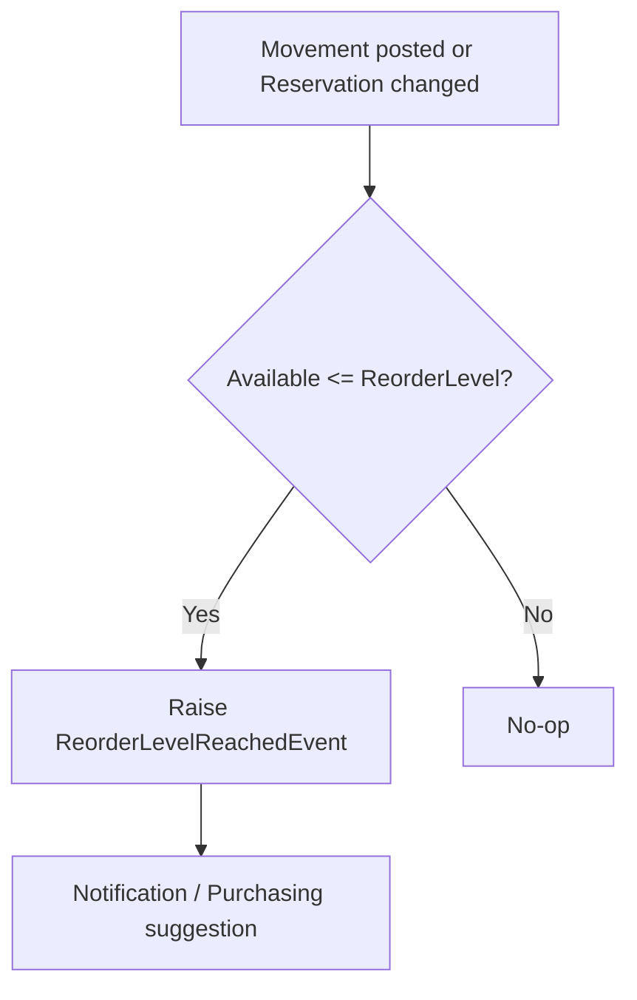
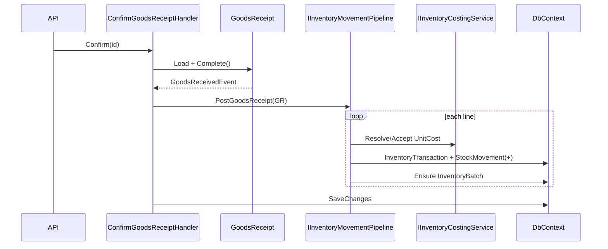
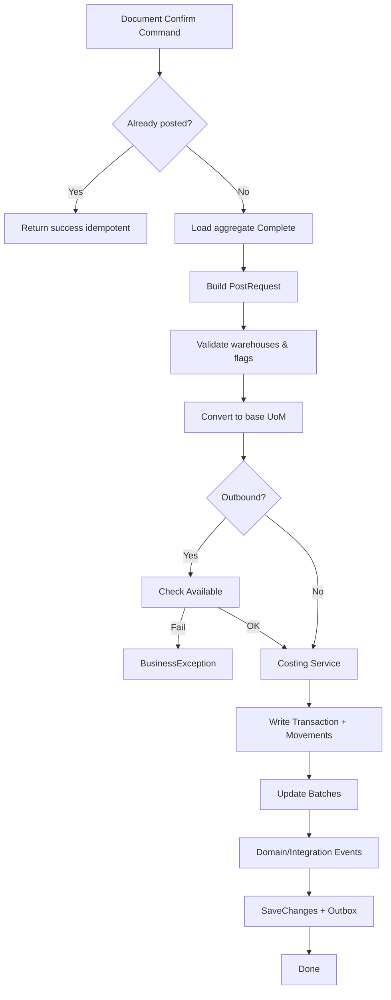

# GastroERP — Inventory Module Architecture Document

# Part 04 — Inventory Balance, Transactions, Movement Pipeline

**Continues from Part 03 · Sections 10–12**

---

# 10. Inventory Balance

## 10.1 Balance Model Philosophy

GastroERP treats **On Hand as a derived fact**, not a mutable column on `InventoryItem`:

```text
OnHand(Item, Warehouse) = Σ StockMovement.QuantityChange
                          WHERE Item & Warehouse & Tenant
```

This matches SAP/Dynamics/NetSuite ledger thinking and enables reconstruction, audit, and costing.

## 10.2 Balance Components

| Component | Definition | Source |
|-----------|------------|--------|
| **On Hand** | Posted physical/logical quantity | Sum of movements |
| **Reserved** | Soft holds not yet issued | Sum Active `InventoryReservation.ReservedQuantity` |
| **Allocated** | Firm allocation (target; stronger than reserve) | Future allocation entity or reservation subtype |
| **Available** | On Hand − Reserved (− Allocated) | Computed |
| **Incoming** | Expected inbound not yet posted | Open PO remaining qty / in-transit transfer in |
| **Outgoing** | Expected outbound not yet posted | Open sales/production demand (integration) |
| **Ordered** | Purchasing commitment | PO lines − received |
| **Damaged** | Qty in Damaged warehouses or quarantine batches | WarehouseType.Damaged / BatchStatus.Quarantine |
| **In Transit** | Qty in Transit warehouses or transfer InTransit | WarehouseType.Transit / transfer status |
| **Safety Stock** | Policy minimum buffer | Settings / item extension (target) |
| **Reorder Point** | `ReorderLevel` on item | `InventoryItem.ReorderLevel` |

## 10.3 Product Details Projection (Implemented)

`GetInventoryItemStockByWarehouseQuery` exposes per warehouse:

- On Hand  
- Reserved  
- Available  
- Ordered  
- Incoming  

(Exact computation may combine movements + reservations + open PO; refine when Pipeline is complete.)

## 10.4 Availability Formula (Canonical)

```text
Available = OnHand - ReservedActive - AllocatedFirm
SellableAvailable = Available - QtyInDamagedWarehouses - QtyInQuarantineBatches
NetAvailabilityForPlanning = SellableAvailable + Incoming - Outgoing
```

## 10.5 Negative Stock Policy

`InventorySetting.AllowNegativeInventory`:

| Value | Pipeline behavior (target) |
|-------|----------------------------|
| false | Reject issue/transfer/waste if Available < required |
| true | Allow with warning domain event / audit note |

## 10.6 Balance Read Models (Target)

For performance at scale, materialize:

| Table (target) | Grain | Updated by |
|----------------|-------|------------|
| `InventoryBalance` | Tenant+Item+Warehouse | Pipeline synchronously or outbox projection |
| `InventoryBalanceByBin` | +Bin | Optional |
| `InventoryBalanceByBatch` | +Batch | When batch tracking on |

Until materialization exists, queries aggregate `StockMovements` with covering indexes.

## 10.7 Reorder Logic



Event exists (`ReorderLevelReachedEvent`); wire from Pipeline/Availability service.

---

# 11. Inventory Transactions

## 11.1 Transaction Types (Domain Enum)

| TransactionType | Sign Intent | Typical Document |
|-----------------|-------------|------------------|
| GoodsReceipt | + | GoodsReceipt |
| PurchaseReturn | − | PurchaseReturn |
| StockTransferOut | − | StockTransfer (source) |
| StockTransferIn | + | StockTransfer (destination) |
| StockAdjustmentPositive | + | StockAdjustment |
| StockAdjustmentNegative | − | StockAdjustment |
| Waste | − | WasteRecord |
| SalesConsumption | − | Sales/POS issue |
| ProductionIssue | − | Production order |
| ProductionReceipt | + | Production completion |
| StockCountCorrection | ± | StockCount variance |

## 11.2 Document Catalog

### Goods Receipt (GRN)

- **Business:** Confirm supplier delivery into warehouse  
- **API:** create → add lines → confirm  
- **Pipeline:** + movements with UnitCost from line; create/update batches  

### Goods Issue (Target)

- **Business:** Non-sales issue (internal, sampling) or unified issue API  
- **Status:** Deferred — SalesConsumption / ProductionIssue cover most F&B cases  

### Transfer

- Dual legs Out/In; optional Transit warehouse  

### Adjustment

- Signed qty; reason required for analytics  
- May originate from count variance  

### Count

- Freeze → capture actual → approve → post corrections  

### Waste

- Kitchen spoilage/theft/expiry write-off with cost  

### Reservation / Release

- Soft; no movement until consume  

### Purchase Return

- Ship back to supplier; − On Hand  

### Sales Return (Target)

- + On Hand into Returns warehouse; quality check  

### Opening / Closing (Target)

- Opening: initial balances as GoodsReceipt-like or OpeningTransaction type  
- Closing: period snapshot (`InventoryDailySnapshot` AI entity exists)  

## 11.3 Document State Machines (Summary)

| Document | Happy path |
|----------|------------|
| PO | Draft → Submit → Approve → Sent → Partially/Fully Received → Close |
| GRN | Draft → Completed |
| Transfer | Draft → (InTransit) → Completed |
| Count | Draft → InProgress → Review → Completed |
| Adjustment/Waste | Draft lines → Complete/Confirm |
| Reservation | Active → Fulfilled \| Cancelled \| Expired |

## 11.4 Sequence — Goods Receipt Confirm (Target)



## 11.5 Current vs Target for Each Movement

| Movement | Domain | API | UI | Pipeline Post |
|----------|--------|-----|----|---------------|
| GRN | ✅ | ✅ | ✅ | ❌ → Required |
| Purchase Return | ✅ | ✅ | ✅ | ❌ → Required |
| Transfer | ✅ | ✅ | ✅ | ❌ → Required |
| Adjustment | ✅ | ✅ | ✅ | ❌ → Required |
| Waste | ✅ | ✅ | ✅ | ❌ → Required |
| Count correction | ✅ | ✅ | ✅ | ❌ → Required |
| Reservation | ✅ | ✅ | Partial | N/A |
| SalesConsumption | Enum | ❌ | ❌ | Required via Sales |
| Production Issue/Receipt | Enum | ❌ | ❌ | Required via Production |
| Sales Return | ❌ | ❌ | ❌ | Target |
| Opening | ❌ | ❌ | ❌ | Target |

---

# 12. Inventory Pipeline

## 12.1 Principle

> **No module updates stock directly.**  
> All inventory quantity and cost changes go through **one Inventory Movement Pipeline**.

This is the single most important enterprise rule for GastroERP Inventory.

## 12.2 Forbidden Patterns

```csharp
// FORBIDDEN
item.OnHand += qty;
warehouseBalance.Quantity = x;
db.Database.ExecuteSql($"UPDATE Stock SET Qty = Qty + {q}");
```

## 12.3 Allowed Pattern

```csharp
// REQUIRED
await pipeline.PostAsync(new PostStockRequest(
    TenantId, TransactionType.GoodsReceipt,
    ReferenceDocumentId, ReferenceNumber,
    movements: [ new(ItemId, WarehouseId, +qty, unitCost, batchId) ],
    ct));
```

## 12.4 Pipeline Responsibilities

| Responsibility | Detail |
|----------------|--------|
| Validate tenant & warehouse flags | Allow* permissions |
| Convert units to base | Via UnitConversion |
| Check availability | For outbound types |
| Resolve unit cost | Costing strategy |
| Create InventoryTransaction | Header |
| Append StockMovement(s) | Lines |
| Update batch remaining | Status transitions |
| Raise StockMovementRecordedEvent | Per movement |
| Trigger reorder evaluation | After post |
| Emit integration events | Finance / Notifications |
| Idempotency | Same document confirm twice = no double post |

## 12.5 Pipeline Flow



## 12.6 Suggested Application Contract

```csharp
public interface IInventoryMovementPipeline
{
    Task<Result<Guid>> PostAsync(PostInventoryRequest request, CancellationToken ct);
}

public sealed record PostInventoryRequest(
    Guid TenantId,
    TransactionType TransactionType,
    Guid ReferenceDocumentId,
    string ReferenceDocumentNumber,
    DateTimeOffset TransactionDate,
    string? Notes,
    IReadOnlyList<PostInventoryMovement> Movements);

public sealed record PostInventoryMovement(
    Guid InventoryItemId,
    Guid WarehouseId,
    Guid? WarehouseBinId,
    Guid UnitId,
    decimal QuantityInDocumentUnit,
    decimal? ExplicitUnitCost,
    Guid? InventoryBatchId,
    string? BatchNumber,
    DateTimeOffset? Expiry);
```

## 12.7 Idempotency Key

Unique index (target):

`(TenantId, TransactionType, ReferenceDocumentId)` on `InventoryTransactions`

Confirm handlers become safe under retries / offline sync.

## 12.8 Dual-Leg Transfer Posting

One Pipeline call may create **one transaction with two movements** or **two transactions** linked by transfer id. Recommended:

- Single `InventoryTransaction` is awkward for TransferOut/In enum  
- Prefer **two transactions** sharing `ReferenceDocumentId = TransferId` with types Out and In  
- Or one transaction type extension — keep two typed transactions for reporting clarity  

## 12.9 Integration with Confirm Handlers

Refactor pattern:

```text
ConfirmXCommandHandler
  1. Load aggregate
  2. aggregate.Complete() / domain transitions
  3. pipeline.PostAsync(...)
  4. SaveChanges (shared UoW)
```

Today steps 1–2 exist; **step 3 is the critical gap**.

## 12.10 Offline Readiness

| Concern | Pipeline Support |
|---------|------------------|
| Replay | Idempotent reference keys |
| Conflict | RowVersion on documents; reject stale confirm |
| Queue | Device queues Confirm commands; server Pipeline posts once |

## 12.11 Part 04 Conclusion

Balances are derived; transactions are typed; the Pipeline is the **enterprise backbone**. Completing Pipeline wiring converts Phase E document MVP into true stock truth comparable to SAP document posting.

---

> **Continue with Part 05**
