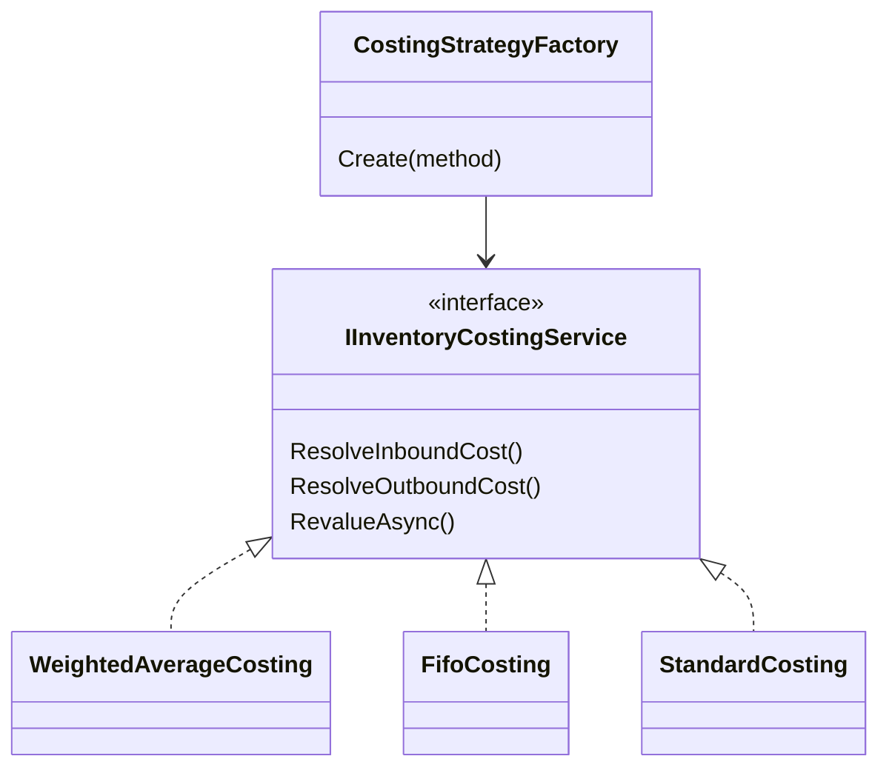
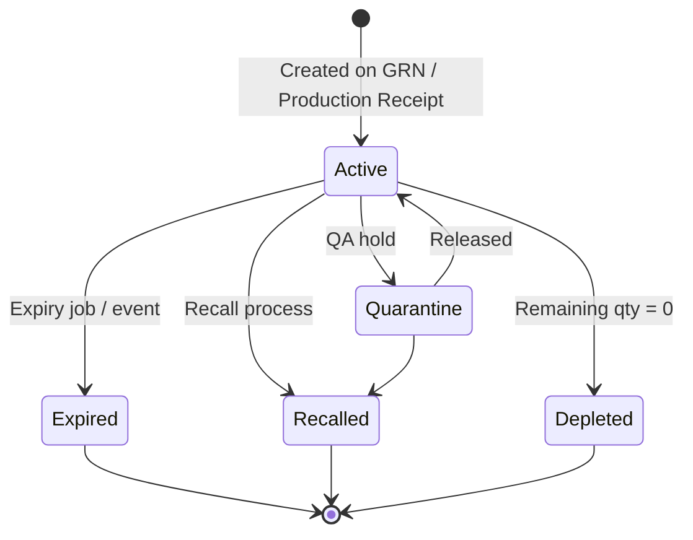
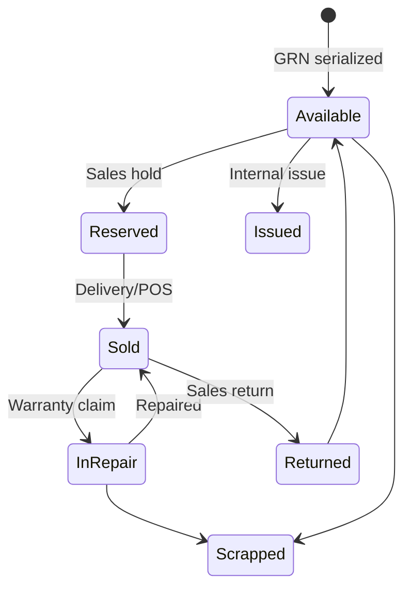
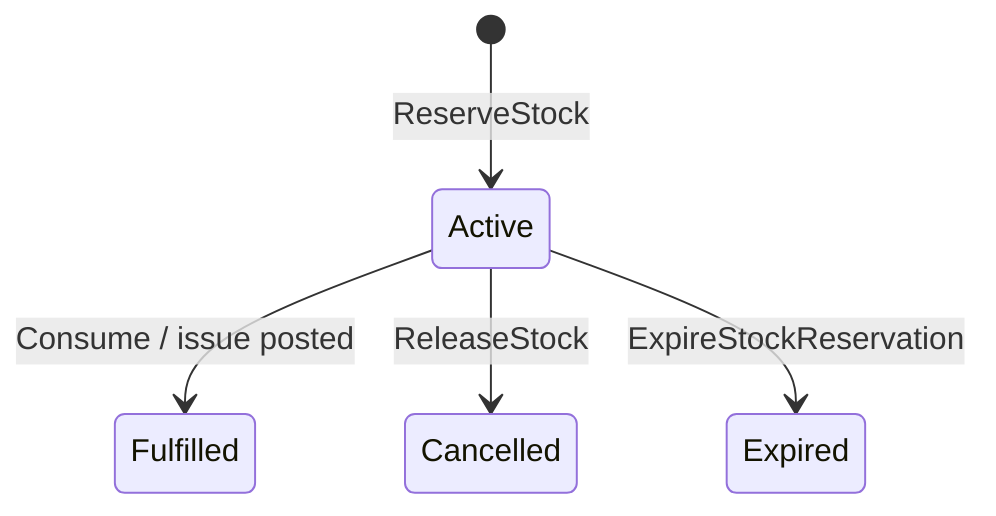
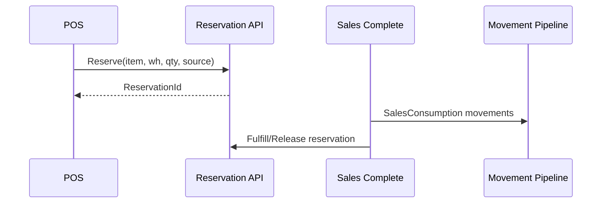

# GastroERP — Inventory Module Architecture Document

# Part 05 — Cost Engine, Batch, Serial, Reservation Engine

**Continues from Part 04 · Sections 13–16**

---

# 13. Inventory Cost Engine

## 13.1 Purpose

Determine **UnitCost** stamped on each `StockMovement` and support **inventory valuation** and **COGS**.

## 13.2 Supported Methods (Enum)

`InventoryCostingMethod` in Domain:

| Method | Value | Description |
|--------|-------|-------------|
| FIFO | 1 | Consume oldest inbound cost layers first |
| WeightedAverage | 2 | Running average (default in `InventorySetting`) |
| Standard Cost | 3 | Predetermined standard; variances to finance |

**LIFO** is intentionally omitted (tax/regulatory rarity; can be added later as strategy without schema break).

## 13.3 Strategy Pattern (Target)



## 13.4 Weighted Average (Default)

**Inbound (+q at cost c):**

```text
NewAvg = (OnHandQty * OldAvg + q * c) / (OnHandQty + q)
```

**Outbound (−q):** use current average as UnitCost on movement.

**Implementation note:** `InventoryItemDtoProjector` already approximates average from inbound movements for reads; Pipeline must keep write-path consistent.

## 13.5 FIFO

Maintain **cost layers** (target table `InventoryCostLayer`):

| Field | Meaning |
|-------|---------|
| TenantId, ItemId, WarehouseId | Grain |
| QuantityRemaining | Layer balance |
| UnitCost | Layer cost |
| SourceMovementId | Trace |
| ReceivedAt | Age |

Outbound depletes oldest layers; movement may split across layers (multiple `StockMovement` lines or movement cost breakdown table).

## 13.6 Standard Cost

- Item (or catalog) holds `StandardUnitCost`  
- Inbound still records actual on movement for variance analysis  
- Outbound uses standard  
- Finance posts purchase price variance / production variance  

## 13.7 Where Cost Lives Today

| Location | Role |
|----------|------|
| `InventorySetting.CostingMethod` | Tenant/branch policy |
| `ProductCatalogDefinition.CostingMethod` | Catalog-level override candidate |
| Document lines UnitCost | Actuals on GRN/Waste/Return/Adjustment |
| `StockMovement.UnitCost` | Ledger stamp |
| Reporting AvgCost | Analytics service |

## 13.8 Extensibility

Adding a method:

1. Extend enum  
2. Implement `IInventoryCostingService` strategy  
3. Register in DI factory  
4. No change to Pipeline orchestration  

## 13.9 Trade-offs

| Method | Pros | Cons |
|--------|------|------|
| WA | Simple, good for F&B commodities | Less precise lot costing |
| FIFO | Accurate expiry-aligned cost | Layer complexity |
| Standard | Stable COGS, variance mgmt | Needs standards maintenance |

---

# 14. Batch Management

## 14.1 Aggregate: `InventoryBatch`

| Property | Purpose |
|----------|---------|
| InventoryItemId | Owner item |
| BatchNumber | Supplier/internal lot code |
| LotNumber? | Alternate identifier |
| ManufacturingDate? | Production date |
| ExpirationDate? | FEFO picking |
| Status | Active, Quarantine, Expired, Depleted, Recalled |

## 14.2 Lifecycle



## 14.3 Remaining Quantity

Derived:

```text
BatchRemaining = Σ movements WHERE InventoryBatchId = batch
```

Or maintained by Pipeline updates for speed.

## 14.4 FEFO / Expiry

- Settings: `RequireExpiryTracking`  
- GRN lines already carry `ProductionDate`, `ExpiryDate`  
- Background job raises `BatchExpiredEvent`  
- Picking/issue prefers earliest expiry (target)

## 14.5 Quality & Supplier Batch

- Supplier batch number stored on GRN line → BatchNumber  
- Quarantine status blocks Available for sales warehouses  
- Recall sets Recalled; Pipeline blocks outbound  

## 14.6 Current Gap

Batch aggregate exists; **automatic creation on GRN confirm** and FEFO issue selection must be completed inside Pipeline.

---

# 15. Serial Number Management

## 15.1 Status

**Not yet a first-class Domain aggregate** in GastroERP Inventory. This section specifies the **target enterprise design** so implementation does not conflict with Batch/Pipeline.

## 15.2 When Serials Apply

| Scenario | Example |
|----------|---------|
| High-value equipment | Coffee machine sold/rented |
| Electronics accessories | POS hardware |
| Tracked returnables | Not typical for raw food |

Most F&B raw materials use **Batch**, not Serial.

## 15.3 Target Aggregate: `InventorySerial`

| Field | Purpose |
|-------|---------|
| SerialNumber | Unique per tenant+item |
| InventoryItemId | Item |
| WarehouseId? | Current location |
| Status | Available, Reserved, Issued, Sold, InRepair, Scrapped, Returned |
| WarrantyUntil? | Warranty tracking |
| ParentSerialId? | Replacement linkage |

## 15.4 Lifecycle



## 15.5 Warranty / Repair / Replacement

- Warranty dates on serial  
- Repair order references SerialId  
- Replacement creates new serial with `ParentSerialId`  

## 15.6 Tracking Integration

- Pipeline movements for serialized items require SerialIds list matching qty  
- Unique index `(TenantId, InventoryItemId, SerialNumber)`  

## 15.7 Implementation Phase

Recommend **Phase J / dedicated Serials epic** after Pipeline + Batch FEFO are stable.

---

# 16. Reservation Engine

## 16.1 Purpose

Protect stock for known demand **without** posting COGS until fulfillment.

## 16.2 Aggregate: `InventoryReservation`

| Field | Purpose |
|-------|---------|
| WarehouseId | Location of hold |
| InventoryItemId | Item |
| ReservedQuantity | Qty held |
| SourceDocument | POS/Sales/Production/Delivery/Online reference |
| Status | Active, Fulfilled, Expired, Cancelled |
| ExpirationDate? | Auto-expire |

Raises `StockReservedEvent` on create.

## 16.3 State Machine



## 16.4 Operations

| Command | Effect |
|---------|--------|
| `ReserveStockCommand` | Create Active reservation if Available ≥ qty |
| `ReleaseStockCommand` | Cancel; free Available |
| `ExpireStockReservationCommand` | Mark Expired |

## 16.5 Allocation vs Reservation

| Concept | Strength | Use |
|---------|----------|-----|
| Reservation | Soft | POS cart, short holds |
| Allocation | Firm (target) | Picked wave, production kit |

Allocation may be modeled as reservation with `IsFirm=true` or separate entity later.

## 16.6 Consumption Flow



**Rule:** Consumption posts Pipeline movement **and** closes reservation in one application workflow (or outbox handler).

## 16.7 Supported Sources

| Source | SourceDocument pattern | Notes |
|--------|------------------------|-------|
| POS | `POS:{OrderId}` | Short TTL |
| Sales | `SO:{SalesOrderId}` | Until delivery |
| Production | `MO:{ManufacturingOrderId}` | Kit reserve |
| Delivery | `DLV:{DeliveryId}` | Route pick |
| Online Orders | `WEB:{OrderId}` | Channel hold |

## 16.8 Auto Flags

`InventorySetting.AutoReserveStock` — when true, Sales create path auto-reserves.  
`AutoIssueRecipe` — production/POS may auto-issue recipe components via Pipeline.

## 16.9 API Surface

`ReservationController`:

- GET `/inventory/reservations`  
- POST `/inventory/reservations`  
- POST `/{id}/release`  
- POST `/{id}/expire`  

## 16.10 UI Gap

No dedicated tab in Operations hub yet — add under Phase E polish or Phase H.

## 16.11 Part 05 Conclusion

Costing is designed for strategy-based expansion; Batch is modeled and awaiting Pipeline automation; Serials are specified for future high-value tracking; Reservations provide soft availability control for POS/Sales/Production without corrupting the ledger.

---

> **Continue with Part 06**
