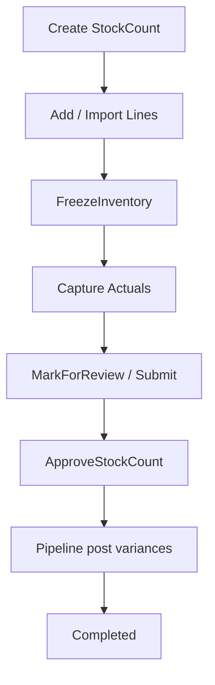
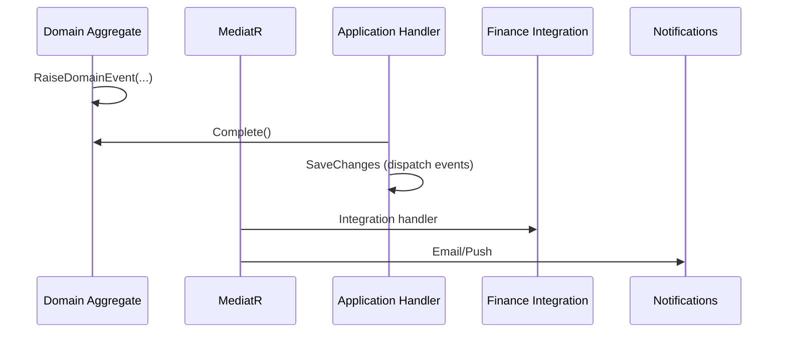

# GastroERP — Inventory Module Architecture Document

# Part 06 — Physical Inventory, CQRS, Domain Events

**Continues from Part 05 · Sections 17–19**

---

# 17. Physical Inventory

## 17.1 Business Purpose

Reconcile **system On Hand** with **physical reality**. Variances become stock corrections via Pipeline (`StockCountCorrection`).

## 17.2 Aggregate: `StockCount`

| Field | Purpose |
|-------|---------|
| WarehouseId | Scope of count |
| CountNumber | Document id |
| CountDate | When performed |
| Status | Draft, InProgress, Review, Completed, Cancelled |
| Notes | Instructions |
| Lines | Expected vs Actual |

**Line:** InventoryItemId, UnitId, ExpectedQuantity, ActualQuantity, BatchNumber?, computed Difference.

## 17.3 Count Modes

| Mode | Description | Support |
|------|-------------|---------|
| Full Inventory Count | All items in warehouse | ✅ via lines |
| Cycle Count | Subset by category/ABC/zone | Target filters |
| Blind Count | Counter does not see Expected | Target UI flag hide expected |
| Batch-level Count | Per batch | Line BatchNumber + future batch expected |

## 17.4 Process Flow



### Freeze

`FreezeInventoryCommand` — intended to lock movements during count (implementation should set warehouse or count lock flag / reject conflicting posts).

### Approval & Posting

`ApproveStockCountCommand` must:

1. Transition status to Completed (`StockCountCompletedEvent`)  
2. For each line where Difference ≠ 0, Pipeline post correction  
3. Optionally auto-create `StockAdjustment` linked via `StockCountId`  

## 17.5 Variance Accounting

```text
Difference = Actual - Expected
Difference > 0 → StockCountCorrection (+) or AdjustmentPositive
Difference < 0 → StockCountCorrection (−) or AdjustmentNegative
```

Finance may map variances to shrinkage/gain GL accounts via integration events.

## 17.6 Events

- `StockCountSubmittedEvent` — review/approval workflow  
- `StockCountCompletedEvent` — finished  

## 17.7 API

`StockCountController`: GET/POST counts, GET by id, POST lines, freeze, approve.

## 17.8 UI

Operations hub **Count** tab: create with expected/actual; approve action.

## 17.9 Controls & Best Practices

| Control | Rationale |
|---------|-----------|
| Segregation: counter ≠ approver | Fraud reduction (Workflow) |
| Blind count option | Reduce expectation bias |
| Freeze window | Prevent double counting vs live ops |
| Snapshot Expected from Available/OnHand at freeze | Deterministic variance |

---

# 18. CQRS Design

## 18.1 Why CQRS Here

Inventory has **asymmetric** needs:

- Writes: strict invariants, status machines, Pipeline side effects  
- Reads: dashboards, 360° product views, valuations, paging  

CQRS via MediatR keeps handlers focused and testable.

## 18.2 Command Pipeline

```text
Controller
  → ISender.Send(Command)
    → ValidationBehavior (FluentValidation)
    → Logging / Transaction behaviors (as configured)
    → Command Handler
      → Domain aggregate methods
      → IInventoryMovementPipeline (target)
      → IApplicationDbContext.SaveChangesAsync
    → Result / Result<T>
```

## 18.3 Query Pipeline

```text
Controller
  → ISender.Send(Query)
    → Query Handler
      → AsNoTracking EF projections
      → DTO mapping / manual projection
    → PagedResult<T> / Result<T>
```

## 18.4 Command Catalog (Inventory)

See Application `InventoryCommands.cs` — groups:

- Category / Unit / Item / Warehouse CRUD & activate  
- Supplier & financial/rating  
- PO lifecycle (create, lines, approve, send, cancel, reject, close)  
- GRN create/line/confirm  
- Transfer create/line/complete/cancel  
- Adjustment create/confirm  
- Waste create/confirm  
- Recipe CRUD & ingredients  
- Settings upsert  
- Stock count create/line/freeze/approve  
- Purchase return create/line/approve  
- Reservation reserve/release/expire  

## 18.5 Query Catalog

- Master data lists & by-id  
- Low stock  
- Product details: stock-by-warehouse, movements, purchase/sales history  
- Ops lists: GR, transfers, adjustments, waste, counts, returns, reservations, ledger transactions  
- Recipes by product  

## 18.6 Validation

FluentValidation validators under `Features/Inventory/Validators/`:

- Item, Warehouse, Supplier, Purchase, StockOperations, Recipe  

**Rules:** never validate in Controllers; never duplicate Domain invariants that belong in entity methods—validators handle input completeness; Domain handles state transitions.

## 18.7 Handler Guidelines

| Do | Don't |
|----|-------|
| Load aggregate with required Includes | Bypass Domain methods with property hacks |
| Use TenantId from trusted resolver | Trust TenantId from client blindly |
| Return Result failures with codes | Throw for expected business rule breaks (prefer Result/BusinessException policy consistency) |
| Keep handler < ~80 lines; extract Pipeline | Duplicate costing logic per handler |

## 18.8 Mapping

`InventoryMappingProfile` — AutoMapper for many DTOs; complex list projections (GR/Transfer/Adjust/Waste) use **manual projection** for names and first-line flatten.

## 18.9 Paging Contract

`HandlePagedResult` returns data array + `X-Pagination-*` headers. Frontend repositories pass `page` / `pageSize`.

## 18.10 Behaviors (Recommended)

| Behavior | Purpose |
|----------|---------|
| ValidationBehavior | FluentValidation |
| LoggingBehavior | Structured command/query logs |
| TransactionBehavior | Optional ambient transaction |
| PerformanceBehavior | Slow query warnings |

---

# 19. Domain Events

## 19.1 Role of Domain Events

Domain Events capture **facts that already happened** inside the Domain. Application/Infrastructure handlers react (Pipeline side effects already done, notifications, workflow, finance).

## 19.2 Event Catalog

| Event | Payload (core) | Raised When | Consumer Intent |
|-------|----------------|-------------|-----------------|
| `InventoryItemCreatedEvent` | ItemId, TenantId, Name | Item constructed | Search index, audit |
| `GoodsReceivedEvent` | GRN Id, PO Id, WarehouseId, TenantId | GRN.Complete with PO | PO received qty, finance accrual |
| `StockMovementRecordedEvent` | MovementId, TxnId, Item, WH, Qty, TenantId | Pipeline posts movement | Reorder, AI snapshot, cache invalidate |
| `StockReservedEvent` | ReservationId, Item, WH, Qty, TenantId | Reservation created | POS UI, availability cache |
| `ReorderLevelReachedEvent` | Item, WH, CurrentStock, TenantId | Availability ≤ reorder | Purchasing alert |
| `BatchExpiredEvent` | BatchId, Item, WH, TenantId | Expiry job | Block issue, notify |
| `StockCountCompletedEvent` | CountId, WH, TenantId | Count.Complete | Reporting |
| `PurchaseOrderSubmittedEvent` | PO Id, TenantId, Total | PO submit | Workflow approval |
| `StockCountSubmittedEvent` | CountId, TenantId, WH | Count review | Workflow |
| `StockAdjustmentSubmittedEvent` | AdjustmentId, TenantId | Adj submit | Workflow |
| `StockTransferSubmittedEvent` | TransferId, TenantId | Transfer submit | Workflow |

## 19.3 Event Flow (Target)



## 19.4 Implementation Status

| Event | Raised in Domain | Handled |
|-------|------------------|---------|
| InventoryItemCreated | ✅ | Partial |
| GoodsReceived | ✅ | Partial |
| StockReserved | ✅ | Partial |
| StockCount Completed/Submitted | ✅ | Partial |
| PO/Adj/Transfer Submitted | ✅ | Workflow-dependent |
| StockMovementRecorded | ❌ not raised yet | — |
| ReorderLevelReached | ❌ | Automation stub possible |
| BatchExpired | ❌ | — |

## 19.5 Design Rules

1. Events are past tense and immutable facts.  
2. Do not use events to *request* work that must be synchronous for consistency (post stock in Pipeline inside the same UoW).  
3. Use integration events (outbox) for cross-context eventual consistency.  
4. Never include EF entities in event payloads — primitives/Guids only.

## 19.6 Future Events (Recommended)

| Event | When |
|-------|------|
| `GoodsIssuedEvent` | Sales/Production issue posted |
| `InventoryTransferredEvent` | Transfer fully posted both legs |
| `InventoryAdjustedEvent` | Adjustment posted |
| `WasteRecordedEvent` | Waste posted |
| `ReservationReleasedEvent` | Release/Expire |
| `ProductionCompletedEvent` | FG receipt + component issues |

## 19.7 Part 06 Conclusion

Physical inventory is document-driven with a clear path to variance posting. CQRS structure is production-grade. Domain Events are well-named; completing Pipeline should start raising `StockMovementRecordedEvent` and reorder/expiry events to close the automation loop.

---

> **Continue with Part 07**
