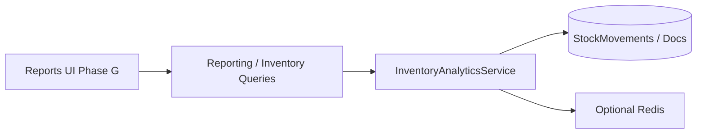
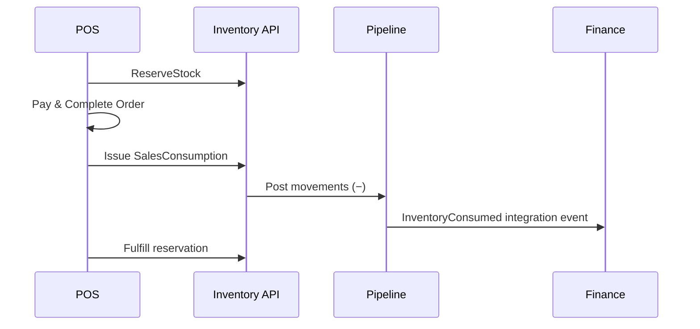

# GastroERP — Inventory Module Architecture Document

# Part 08 — Reports, Security, Integration

**Continues from Part 07 · Sections 23–25**

---

# 23. Reports

## 23.1 Reporting Principles

- Prefer **read models / analytics services** over overloading transactional queries  
- Always filter `TenantId`  
- Support date range, warehouse, category, item  
- Export CSV/PDF in Phase G UI  
- Valuation must declare costing method used  

## 23.2 Report Catalog

### Inventory Ledger

| Attribute | Detail |
|-----------|--------|
| Purpose | Chronological movements with running balance |
| Source | `InventoryTransaction` + `StockMovement` |
| Dimensions | Item, Warehouse, Date, Type, Reference |
| Status | Partial (item movements API); full ledger report UI Phase G |

### Inventory Valuation

| Attribute | Detail |
|-----------|--------|
| Purpose | On Hand × cost per item/warehouse |
| Source | Balances + costing method |
| Backend | `GetStockValuationReportQuery` / analytics |
| UI | Phase G |

### ABC Analysis

| Attribute | Detail |
|-----------|--------|
| Purpose | Classify items by consumption/value (A/B/C) |
| Inputs | Movement history value over period |
| Use | Cycle count prioritization |

### Inventory Turnover

| Attribute | Detail |
|-----------|--------|
| Formula | COGS / Average Inventory Value |
| Period | Monthly / quarterly |

### Warehouse Balance

| Attribute | Detail |
|-----------|--------|
| Purpose | Matrix warehouses × items or totals per WH |
| UI seed | Product Details stock-by-warehouse |

### Movement History

| Attribute | Detail |
|-----------|--------|
| Purpose | Filterable movement list |
| API | Item movements + ledger GET `/stock` |

### Low Stock

| Attribute | Detail |
|-----------|--------|
| Query | `GetLowStockItemsQuery` |
| Dashboard | KPI + Phase F widget |

### Dead Stock

| Attribute | Detail |
|-----------|--------|
| Definition | No outbound movement for N days while OnHand > 0 |
| Action | Promotion, transfer, or waste review |

### Fast Moving / Slow Moving

| Attribute | Detail |
|-----------|--------|
| Metric | Outbound qty or value velocity |
| Use | Reorder policy & warehouse slotting |

### Waste Report

| Attribute | Detail |
|-----------|--------|
| Source | Waste transactions / WasteRecord |
| Dimensions | Reason, warehouse, item, cost |

### Purchase vs Receipt Variance

| Attribute | Detail |
|-----------|--------|
| Source | PO lines vs GRN received |
| Use | Supplier performance |

### Batch Expiry Report

| Attribute | Detail |
|-----------|--------|
| Source | `InventoryBatch` |
| Buckets | Expired, 7d, 30d, 90d |

## 23.3 Permissions

`InventoryReports.View`, `Reports.Export`, possibly `Finance` for valuation.

## 23.4 Architecture



---

# 24. Security

## 24.1 RBAC Model

Permissions (Application `Permissions` class):

| Group | Examples |
|-------|----------|
| Inventory | View, Manage |
| Warehouse | View, Create, Update, Activate |
| Stock | View, Transfer, Adjust, Waste |
| Purchase | View, Create, Approve, Cancel |
| Supplier | View, Create, Update, Manage |
| Recipe | View, Create, Update, Activate |
| InventoryReports | View |

Presentation: `[HasPermission(Permissions.Stock.Transfer)]`  
Frontend: `permissionGuard` + `AuthService.hasPermission` aliases.

## 24.2 Approval Workflow

Domain submit events (`PurchaseOrderSubmitted`, `StockCountSubmitted`, `StockAdjustmentSubmitted`, `StockTransferSubmitted`) integrate with Workflow context for maker-checker.

| Document | Suggested policy |
|----------|------------------|
| PO above threshold | Approval required |
| Adjustment | Always dual control if |qty| or value high |
| Count | Counter ≠ Approver |
| Transfer cross-branch | Branch manager approve |

## 24.3 Audit Trail

`AuditableBaseEntity`: CreatedAt/By, UpdatedAt/By, DeletedAt/By (soft delete).  
Ledger movements: append-only, no soft delete.  
Document numbers + ReferenceDocumentId provide forensic links.

## 24.4 Soft Delete

Master data uses soft delete where configured. Stock movements must never soft-delete; reverse via compensating transaction (adjustment).

## 24.5 Concurrency

| Mechanism | Use |
|-----------|-----|
| EF RowVersion / UpdatedAt check | Document confirm |
| Idempotent Pipeline keys | Double-post prevention |
| Freeze during count | Operational lock |

## 24.6 Input Trust

- Never trust client `TenantId`  
- Validate warehouse belongs to tenant  
- Sanitize notes lengths  
- Parameterized EF only (no raw SQL concatenation)  

## 24.7 Sensitive Data

Cost/valuation endpoints may need stricter permissions than stock view.

---

# 25. Integration

## 25.1 Purchasing

```text
Supplier → PO → GRN → Pipeline(+) → Optional PurchaseReturn Pipeline(−)
```

PO `ReceivedQuantity` updated on GoodsReceived handling (target).

## 25.2 Sales / POS

```text
Reserve → (pick) → SalesConsumption Pipeline(−) → Fulfill reservation
Sales Return → Pipeline(+) into Returns WH
```

## 25.3 Production

```text
Reserve components → ProductionIssue (−) → ProductionReceipt (+) FG
Recipe.AutoIssueRecipe setting
```

## 25.4 Finance

| Inventory Fact | Finance Effect |
|----------------|----------------|
| GRN | Inventory asset / GRNI clearing |
| Waste | Shrinkage expense |
| COGS on SalesConsumption | COGS / Inventory |
| Count variance | Gain/Loss |
| Valuation | Balance sheet inventory |

Prefer integration events after Pipeline commit (outbox).

## 25.5 CRM

Limited direct stock coupling; customer returns may create Sales Return docs.

## 25.6 Workflow

Approval on submitted inventory documents.

## 25.7 Notifications

Reorder, expiry, approval pending, transfer arrived.

## 25.8 AI

`InventoryDailySnapshot` — consumption, waste, closing balance for forecasting and recommendations (`Ai.*` permissions).

## 25.9 Catalog

Coordinator only; section APIs keep Item/Recipe/Product synchronized without merging.

## 25.10 Integration Sequence (POS Sale)



## 25.11 Part 08 Conclusion

Reports define the analytical contract for Phase G; Security is RBAC + audit + soft delete with ledger immutability; Integrations must all funnel quantity changes through the Pipeline while using events for cross-context reactions.

---

> **Continue with Part 09**
