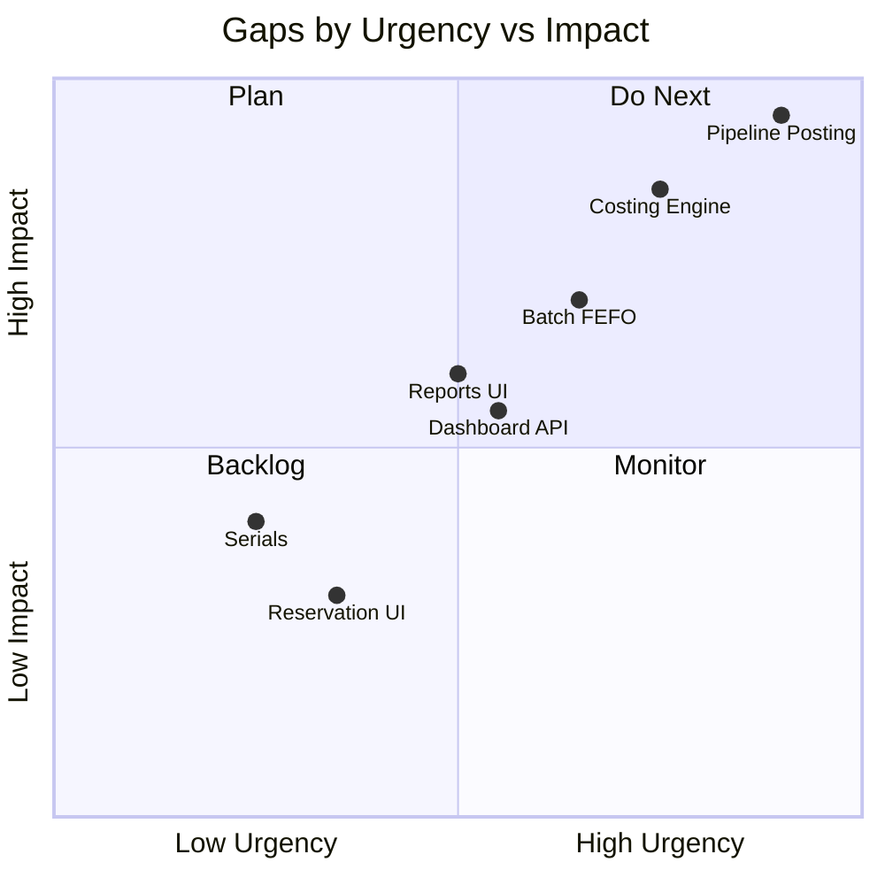

# GastroERP — Inventory Module Architecture Document

# Part 09 — Performance, Gap Analysis, SOLID Assessment

**Continues from Part 08 · Sections 26–28**

---

# 26. Performance

## 26.1 Goals

| Scenario | Target |
|----------|--------|
| Item list page (100 rows) | < 300 ms server |
| Confirm GRN (20 lines) | < 500 ms including Pipeline |
| Product Details stock matrix | < 400 ms |
| Dashboard summary | < 600 ms (cached) |
| Valuation report 10k SKUs | Async/job or pre-agg |

## 26.2 Indexing Recommendations

| Table | Index |
|-------|-------|
| StockMovements | `(TenantId, InventoryItemId, WarehouseId, CreatedAt)` |
| StockMovements | `(TenantId, InventoryTransactionId)` |
| InventoryTransactions | `(TenantId, ReferenceDocumentId, TransactionType)` UNIQUE |
| InventoryReservations | `(TenantId, WarehouseId, InventoryItemId, Status)` |
| InventoryItems | `(TenantId, IsActive, CategoryId)` include NameAr |
| InventoryBatches | `(TenantId, ExpirationDate, Status)` |
| PurchaseOrderLines | `(PurchaseOrderId)`, `(InventoryItemId)` |

## 26.3 Caching Strategy

| Data | Cache | TTL |
|------|-------|-----|
| Categories, Units | Memory/Redis | 5–15 min + invalidate on write |
| Warehouses | Memory/Redis | 5 min |
| InventorySettings | Memory | Per tenant |
| Dashboard summary | Redis | 1–2 min |
| Balances | Prefer materialized table over cache of aggregates | — |

## 26.4 Read Models

- Product details already projects stock & histories  
- Target `InventoryBalance` table maintained by Pipeline  
- AI daily snapshots for heavy analytics  

## 26.5 Pagination

All list endpoints accept page/pageSize; default caps (20–50); UI must not request unbounded lists except units/categories master (≤200).

## 26.6 Background Jobs

| Job | Purpose |
|-----|---------|
| ExpireReservations | Status → Expired |
| ExpireBatches | Status → Expired + event |
| ReorderSweep | Evaluate low stock |
| DailySnapshot | AI/reporting |
| ValuationMaterialize | Nightly valuation cube |

## 26.7 Optimistic Concurrency

- Documents: check `IsCompleted` / status before confirm  
- Settings: row version  
- Offline: idempotency keys  

## 26.8 N+1 Prevention

- `Include` lines when needed  
- Prefer projection queries  
- Batch name lookups via dictionaries (as in GR/Transfer query handlers)  

## 26.9 Async I/O

All handlers `async`/`await`; no sync-over-async; no blocking SQL.

---

# 27. Gap Analysis

## 27.1 Current vs Target Summary

| Area | Current | Target | Gap Severity |
|------|---------|--------|--------------|
| Master data CRUD | ✅ | ✅ | Low |
| Product chain | ✅ | ✅ | Low |
| Product Details | ✅ | ✅ | Low |
| Ops documents + UI | ✅ MVP | ✅ + GI/SR | Medium |
| Movement Pipeline posting | ❌ | ✅ Mandatory | **Critical** |
| Costing strategies | Enum only | WA/FIFO/Standard engines | **High** |
| Batch automation | Model only | FEFO + auto-create | High |
| Serials | Absent | Optional aggregate | Medium |
| Reservation UI | API only | Hub tab | Low |
| Dashboard API | Client KPI | Dedicated | Medium |
| Reports UI | Placeholder | Full suite | Medium |
| Opening balances | Absent | First-class | Medium |
| Freeze enforcement | Command exists | Hard lock | Medium |
| Outbox integration events | Partial | Standard | Medium |

## 27.2 Required Improvements (Priority Ordered)

1. Implement `IInventoryMovementPipeline` and wire all Confirm/Complete/Approve handlers.  
2. Add unique idempotency on transactions.  
3. Implement WeightedAverage costing service; stamp movements.  
4. Materialize `InventoryBalance` or ensure indexed sum performance.  
5. Auto-create batches on GRN; expiry job.  
6. Sales/POS consumption + reservation fulfillment workflow.  
7. Phase F dashboard API.  
8. Phase G reports UI on existing analytics.  
9. FIFO layers (if customer requires).  
10. Serials epic (if needed).  

## 27.3 Gap Heatmap

---

# 28. SOLID Assessment

## 28.1 Single Responsibility Principle (SRP)

| Component | Assessment | Notes |
|-----------|------------|-------|
| Controllers | ✅ Strong | Thin MediatR only |
| Aggregates | ✅ Strong | Document vs ledger separated |
| Confirm handlers | ⚠️ | Will grow when Pipeline added — keep orchestration only |
| Product Master page | ⚠️ Large | Orchestrator UI; acceptable if sections delegated |
| StockController | ⚠️ | Multiple ops; could split Transfer/Adjust/Waste controllers later |

**Score: 8/10**

## 28.2 Open/Closed Principle (OCP)

| Area | Assessment |
|------|------------|
| TransactionType enum expansion | ✅ Open for new types |
| Costing strategies | 🎯 Designed; implement via interface |
| Pipeline | Must be OCP — new docs register post adapters |
| Catalog coordinator sections | ✅ Tab composition |

**Score: 7/10** (rises to 9 with strategy costing + pipeline adapters)

## 28.3 Liskov Substitution Principle (LSP)

- No deep inheritance hierarchies in Inventory Domain — composition preferred ✅  
- Handler interfaces via MediatR `IRequestHandler` ✅  

**Score: 9/10**

## 28.4 Interface Segregation Principle (ISP)

| Area | Assessment |
|------|------------|
| `IApplicationDbContext` | ⚠️ Large God-interface (common trade-off) |
| Target Pipeline/Costing/Availability interfaces | ✅ Fine-grained |
| Angular `InventoryRepository` | Growing — still cohesive for inventory |

**Score: 6.5/10** — mitigate with focused application interfaces for stock path.

## 28.5 Dependency Inversion Principle (DIP)

| Area | Assessment |
|------|------------|
| Domain has no EF | ✅ |
| Application depends on abstractions (`IApplicationDbContext`) | ✅ |
| Handlers new up concretes | Rarely — prefer DI |
| Costing currently absent as abstraction | ❌ Gap |

**Score: 7.5/10**

## 28.6 SOLID Recommendations

1. Introduce `IInventoryMovementPipeline`, `IInventoryCostingService`, `IAvailabilityService`.  
2. Split `StockController` when endpoint count hurts discoverability.  
3. Avoid bloating `IApplicationDbContext` further without facades for Inventory.  
4. Keep Domain free of MediatR (events via domain event collection + dispatcher).  
5. Product Master: extract section components (already largely) and avoid stock writes.  

## 28.7 Part 09 Conclusion

Performance work centers on indexes, balance materialization, and caching. Gap analysis confirms Pipeline + Costing as the critical path. SOLID posture is strong for an ERP MVP; DIP/ISP improvements around the stock write path unlock enterprise extensibility.

---

> **Continue with Part 10**
