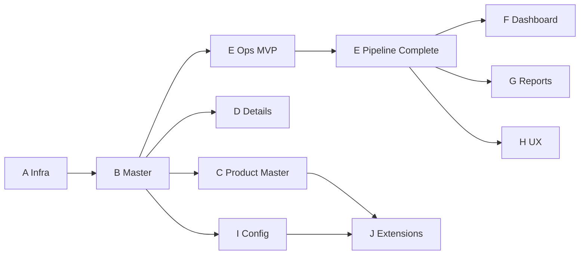

# GastroERP — Inventory Module Architecture Document

# Part 10 — Technical Debt, Implementation Roadmap, Final Assessment

**Continues from Part 09 · Sections 29–31**

---

# 29. Technical Debt

## 29.1 Problem Register

| ID | Problem | Risk | Effort | Priority |
|----|---------|------|--------|----------|
| TD-01 | Confirm handlers do not post `InventoryTransaction`/`StockMovement` | Critical — false stock confidence | L | P0 |
| TD-02 | No `IInventoryCostingService` | High — wrong COGS/valuation | L | P0 |
| TD-03 | `StockMovementRecordedEvent` never raised | Medium — automation blind | S | P1 |
| TD-04 | Reorder/BatchExpired events unused | Medium | M | P1 |
| TD-05 | Adjustment/Waste allow `Guid.Empty` reason | Medium — analytics pollution | S | P1 |
| TD-06 | FreezeInventory may not hard-block Pipeline | High during counts | M | P1 |
| TD-07 | No idempotent unique index on transactions | High under retries | S | P0 |
| TD-08 | Catalog `__pm` JSON extras for tax/logistics/accounting | Medium — schema drift | M | P2 |
| TD-09 | Zones/Bins Domain without full API/UI | Low–Medium | M | P2 |
| TD-10 | Reservation not in Operations hub | Low | S | P2 |
| TD-11 | Goods Issue / Sales Return missing | Medium ops gap | L | P1 |
| TD-12 | Opening balance process missing | Medium go-live | M | P1 |
| TD-13 | No materialized balance table | Performance at scale | L | P2 |
| TD-14 | StockController concentration | Maintainability | S | P3 |
| TD-15 | Large `IApplicationDbContext` | ISP | L | P3 |
| TD-16 | Reports UI placeholder | Product completeness | L | P2 |
| TD-17 | Dashboard client-side KPIs only | Accuracy/perf | M | P2 |
| TD-18 | Serial numbers unspecified in code | Future need | L | P3 |
| TD-19 | Transfer complete without availability check | Oversell/over-issue | M | P0 after Pipeline |
| TD-20 | Multi-step FE creates without saga compensation | Partial docs on failure | M | P2 |

## 29.2 Risk Themes

1. **Truth gap** — documents ≠ ledger  
2. **Valuation gap** — method declared ≠ calculated  
3. **Automation gap** — events defined ≠ dispatched  
4. **Go-live gap** — opening balances & GI/SR  

## 29.3 Future Improvements (Non-Debt Enhancements)

- FEFO picking service  
- Landed cost on GRN  
- Inter-company transfer & ownership  
- Catch-weight / dual UoM advanced  
- Mobile cycle count app  
- Barcode scanning UX (Phase H)  
- Workflow templates pack for inventory docs  

---

# 30. Implementation Roadmap

## Phase A — Infrastructure ✅

**Objectives:** Lazy module shell, permissions, navigation, i18n, empty states.  

**Deliverables:** `inventory.routes.ts`, sidebar, page shell, dashboard entry, placeholders.  

**Dependencies:** Auth permissions, app layout.  

**Acceptance:** User with `Inventory.View` opens `/inventory/dashboard`; unauthorized blocked.

## Phase B — Master Data ✅

**Objectives:** Categories, Units, Warehouses CRUD.  

**Deliverables:** Pages + API + migration `ExpandInventoryMasterDataPhaseB`.  

**Dependencies:** Phase A.  

**Acceptance:** Create hierarchical category, unit, typed warehouse with Allow* flags.

## Phase C — Product Master ✅

**Objectives:** 14-tab coordinator UI without merging entities.  

**Deliverables:** `/catalog/master`, section API orchestration, type-aware tabs.  

**Dependencies:** Catalog + Inventory + Recipe APIs.  

**Acceptance:** Creating a definition never collapses Item/Recipe/Product tables; tabs respect type flags.

## Phase D — Product Details ✅

**Objectives:** 360° inventory view for an item.  

**Deliverables:** Details page + stock/movements/history APIs.  

**Dependencies:** Phase B items/warehouses.  

**Acceptance:** Stock matrix and timelines load for an item id.

## Phase E — Inventory Operations ✅ (MVP) / Pipeline ⏳

**Objectives:** Operational documents hub; wire APIs.  

**Deliverables:** Operations page; GRN controller; Stock ops endpoints; query handlers.  

**Deferred:** GI, Sales Return, Production post, **Pipeline ledger posting**.  

**Dependencies:** B–D.  

**Acceptance (MVP):** User can create transfer/adjust/waste/GRN/count/return documents.  
**Acceptance (Complete E):** Confirm posts ledger idempotently; Available reflects movements.

### Phase E-Complete (Recommended Immediate Epic)

| Deliverable | Acceptance |
|-------------|------------|
| `IInventoryMovementPipeline` | All confirms call it |
| Unique (Tenant, Type, RefDoc) | Double confirm safe |
| WA costing stamp | Movement UnitCost set |
| Availability check | Outbound fails when insufficient |

## Phase F — Dashboard

**Objectives:** Server-side KPIs, charts, alerts, quick actions.  

**Deliverables:** `GET /inventory/dashboard/summary`, chart widgets, alert list.  

**Dependencies:** Pipeline (for accurate KPIs).  

**Acceptance:** Dashboard matches ledger-derived low stock and values within SLA.

## Phase G — Reports

**Objectives:** Full report UI.  

**Deliverables:** Ledger, Valuation, ABC, Turnover, WH Balance, Low/Dead/Fast/Slow, Waste, Expiry.  

**Dependencies:** Pipeline + costing; existing analytics services.  

**Acceptance:** Each report filterable; export; permissioned.

## Phase H — UX Enhancements

**Objectives:** Bulk ops, barcode, media, shortcuts, reservation tab.  

**Deliverables:** Scanner flows, keyboard shortcuts, bulk activate, richer media.  

**Dependencies:** Stable ops.  

**Acceptance:** Barcode find item; bulk status change; reservation visible in hub.

## Phase I — Inventory Configuration

**Objectives:** Valuation policies, tracking flags UX, alerts, workflow templates.  

**Deliverables:** Settings UI for `InventorySetting`; alert rules; approval policies.  

**Dependencies:** Identity/Workflow.  

**Acceptance:** Admin changes costing method (with warning); toggles batch/expiry required.

## Phase J — Master Data Extensions

**Objectives:** Brands, manufacturers, attributes, zones/bins UI, price lists, tax groups promotion from JSON.  

**Deliverables:** Extension entities + UI; migrate `__pm` extras to Domain where appropriate.  

**Dependencies:** Catalog/Finance alignment.  

**Acceptance:** Bin-level put-away optional; attributes filterable; no coordinator-as-stock.

## Cross-Phase Dependencies Graph

---

# 31. Final Assessment

## 31.1 Scores (Reaffirmed)

| Dimension | Score |
|-----------|-------|
| Architecture | 8.0 / 10 |
| Operational Readiness (docs/UI) | 6.5 / 10 |
| Operational Readiness (ledger truth) | 3.5 / 10 |
| Scalability Design | 7.0 / 10 |
| Maintainability | 7.5 / 10 |
| Security | 7.5 / 10 |
| Multi-Tenant | 8.0 / 10 |
| Future Expansion | 8.5 / 10 |
| **Enterprise Readiness (overall)** | **6.5 / 10** |

## 31.2 Architecture Score Narrative

GastroERP Inventory demonstrates **mature Clean Architecture / DDD / CQRS structure** comparable to serious ERP cores. The product composition rule (`InventoryItem → Recipe → Product`) is a deliberate restaurant-ERP differentiator and must remain inviolable.

## 31.3 Operational Readiness

**Document operations are usable (Phase E MVP).**  
**Stock financial/operational truth is not enterprise-ready until Pipeline posting ships.** Treat this as a release gate for any customer go-live that depends on on-hand accuracy.

## 31.4 Scalability

Stateless API + tenant filters + pagination provide a good base. Materialized balances, indexes, and jobs are required before 100+ branch tenants with large SKU counts.

## 31.5 Maintainability

Feature folders, validators, and mapping keep change localized. Reducing handler/pipeline duplication and splitting oversized surfaces will preserve velocity.

## 31.6 Future Expansion

Enums, settings, batch model, reservation model, and coordinator pattern leave clear extension points for FIFO, serials, WMS bins, production, and AI — **without breaking the chain**.

## 31.7 Enterprise Readiness Verdict

| Verdict | Detail |
|---------|--------|
| **Foundation** | PRODUCTION-READY for architecture & master data |
| **Operations UI** | READY for pilot with caveats |
| **Ledger / Costing** | **NOT READY** — must complete Pipeline epic |
| **Comparable to** | Dynamics/NetSuite *structure*; not yet posting rigor |
| **Differentiator** | Recipe-centric F&B chain + bilingual ERP UX |

## 31.8 Final Recommendation

1. **Immediately** execute **Phase E-Complete**: Inventory Movement Pipeline + idempotency + Weighted Average costing + availability checks.  
2. **Then** Phase F/G for management visibility.  
3. **Never** merge InventoryItem / Recipe / Product or bypass Pipeline from POS/Sales/Finance.  
4. Use this document as the **Definition of Done** checklist for inventory PRs.  
5. Track debt IDs TD-01/02/07 as **P0** in the engineering backlog until closed.

## 31.9 Sign-Off Checklist

| Checkpoint | Status |
|------------|--------|
| Architecture principle documented | ✅ |
| Bounded context mapped | ✅ |
| Domain model cataloged | ✅ |
| Pipeline mandated | ✅ |
| API & FE described | ✅ |
| Roadmap A–J specified | ✅ |
| Gaps & debt explicit | ✅ |
| Pipeline implemented in code | ❌ Pending |
| Cost engine implemented | ❌ Pending |

---

## Document End Matter

**Document ID:** GE-INV-ARCH-2026-01  
**Parts:** 01–10  
**Location in repo:** `docs/inventory-architecture/`  

| File |
|------|
| `PART-01-Executive-Maturity-CurrentState.md` |
| `PART-02-ModuleMap-BoundedContext-DomainModel.md` |
| `PART-03-ER-Product-Warehouse.md` |
| `PART-04-Balance-Transactions-Pipeline.md` |
| `PART-05-Cost-Batch-Serial-Reservation.md` |
| `PART-06-PhysicalInventory-CQRS-Events.md` |
| `PART-07-API-Frontend-Dashboard.md` |
| `PART-08-Reports-Security-Integration.md` |
| `PART-09-Performance-Gaps-SOLID.md` |
| `PART-10-Debt-Roadmap-FinalAssessment.md` |

---

# Inventory Architecture Documentation Completed
